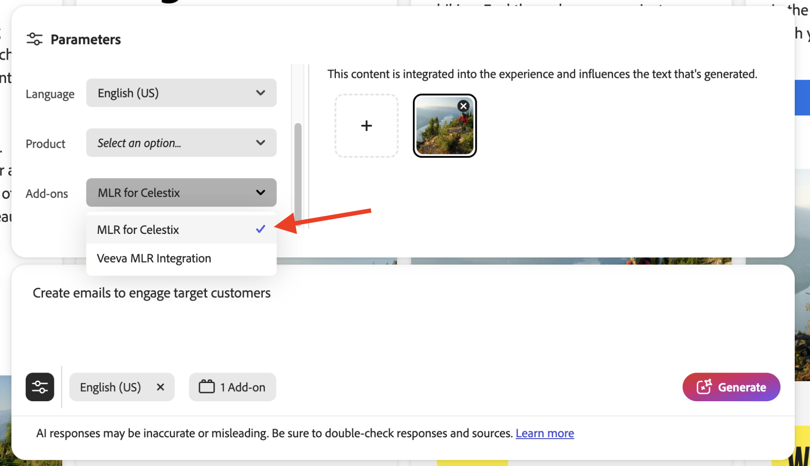
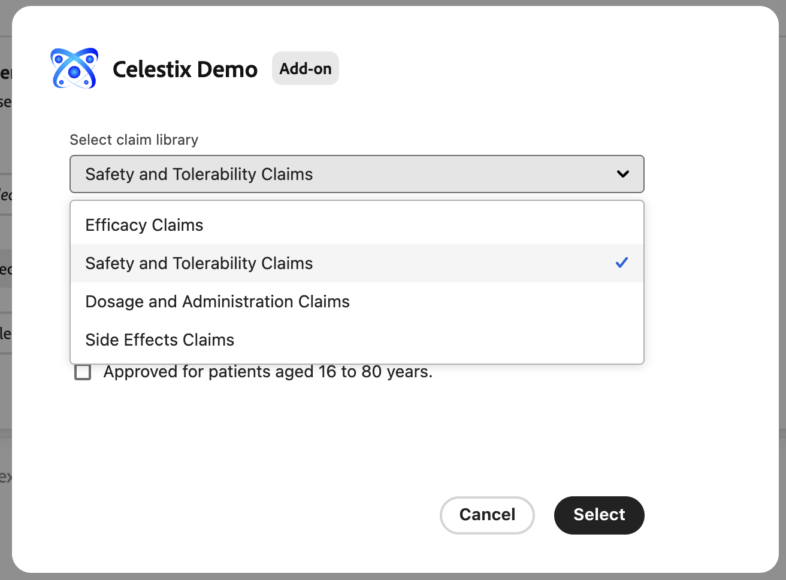
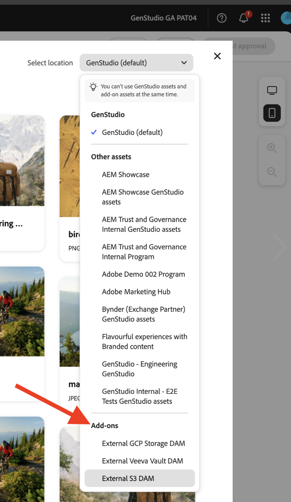
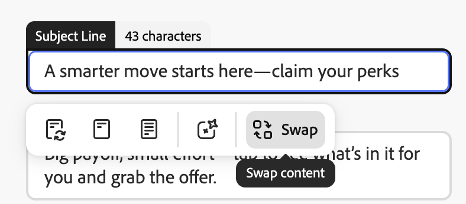

# Déploiement de l’application

L’exécution de votre application offre un instantané préliminaire du comportement de votre module complémentaire avant son déploiement. Cela peut aider au débogage.

## Exécuter l’application

Exécutez l’application dans `https://localhost:9080` :

```bash
aio app run
```

## Déploiement de l’application

1. Accédez à l’espace de travail de déploiement :

   ```bash
   aio app use -w [deployment_workspace]
   ```

2. Déployez l’application :

   ```bash
   aio app deploy
   ```

## Forcer le redéploiement

Vous pouvez forcer une version et le déploiement de votre application sans la soumettre à nouveau pour approbation.

>[!NOTE]
>
>Le fait de forcer une version et un déploiement remplace votre déploiement existant. **Testez minutieusement votre application** dans un environnement de test.

```bash
aio app build --force-build
```

```bash
aio app deploy --force-deploy
```

## Créer et déployer simultanément

```bash
aio app deploy --force-build --force-deploy
```

## Trouver votre nouvelle application

Après le déploiement, vous pouvez afficher la nouvelle application dans GenStudio for Performance Marketing.

### Afficher avec une URL

Voir la nouvelle application en ajoutant un paramètre `query` à l’URL de GenStudio for Performance Marketing :

```txt
https://experience.adobe.com/?ext=https://<my-deployed-add-on>.adobeio-static.net/index.html#/@<ims-org>/genstudio/create
```

### Afficher dans l’interface utilisateur

Les nouvelles extensions se trouvent à différents emplacements dans l’interface utilisateur, selon le type d’extension que vous avez déployé. Les points d’extension actuellement disponibles sont les suivants :

* Extension de conformité, qui inclut :
  * [*points d’extension d’invite*](#find-prompt-extensions), qui permettent aux clients d’ajouter un contexte supplémentaire à la génération LLM ; et
  * [*points d’extension de validation*](#find-validation-extensions), qui permettent aux clients de valider le contenu généré à partir du LLM. La validation est souvent associée à l’extension d’invite pour s’assurer que le contenu généré avec une invite étendue est conforme aux exigences du client (par exemple, réclamations relatives à des médicaments ou demandes juridiques)
* [Extension de la gestion des ressources numériques (DAM)](#find-dam-extensions)
* [Extension de modèle](#find-template-extensions)
* [Extension de traduction](#find-translation-extensions)
* [Extension de fragment de contenu](#find-content-fragment-extension)

### Rechercher des extensions d&#39;invite

Les extensions d’invite se trouvent dans la liste déroulante **Modules complémentaires**, dans la **section paramètres** d’un modèle.

{width="600" zoomable="yes"}

La boîte de dialogue du module complémentaire s’ouvre, vous permettant de sélectionner le contexte supplémentaire à ajouter pour la génération LLM.

{width="600" zoomable="yes"}

### Rechercher des extensions de validation

Les extensions de validation se trouvent après une génération d’invite, dans le volet latéral droit affiché avec les résultats.

{width="600" zoomable="yes"}

Exécutez l’extension sélectionnée pour valider le contenu généré.

{width="600" zoomable="yes"}

En cas d’erreur, vous pouvez utiliser l’extension pour mettre à jour la copie des expériences par programmation. Cliquez sur le bouton **[!UICONTROL Copier]** pour copier le texte suggéré dans le presse-papiers. Cliquez sur le bouton **[!UICONTROL Appliquer]** pour appliquer le texte à une zone de texte spécifique dans l’expérience générée.

{width="600" zoomable="yes"}

### Rechercher des extensions de gestion des ressources numériques

Les extensions de gestion des ressources numériques (DAM) se trouvent lors de la sélection de contenu dans la **section paramètres** d’un modèle. Consultez le bas de la liste déroulante **Sélectionner l’emplacement** pour afficher les modules complémentaires.

{width="600" zoomable="yes"}

### Rechercher des extensions de modèle

Les extensions de modèle se trouvent dans l’onglet **Application de modèle externe** lors de la sélection d’un modèle. Cet onglet s’affiche uniquement lorsqu’il existe des modèles d’application à sélectionner.

{width="600" zoomable="yes"}

### Rechercher des extensions de traduction

Utilisez les points d’extension de traduction pour amener votre propre service de traduction via un proxy au lieu d’utiliser la traduction par défaut de GenStudio.
Il n’existe aucun emplacement d’interface utilisateur pour ces extensions.

Si l’extension est enregistrée, le service de traduction fourni est utilisé. Sinon, le service de traduction GenStudio par défaut est utilisé.

### Rechercher l’extension de fragment de contenu

L’extension Fragment de contenu dans [!DNL GenStudio for Performance Marketing] remplace le texte dans les expériences d’e-mail générées sur la zone de travail de [!DNL Create] par des entrées d’un référentiel tiers connecté (3P). Après avoir configuré et déployé l’extension, vous permutez la copie de la zone de travail sans quitter votre workflow.

>[!NOTE]
>
>La permutation d’extension de fragment de contenu est aujourd’hui disponible pour les expériences **e-mail** sur la zone de travail. La prise en charge du canal **Horizon** sera bientôt disponible.

**Pour permuter du texte à l’aide de l’extension de fragment de contenu** :

1. Sur la zone de travail, cliquez sur un champ de texte modifiable dans une variante d’e-mail générée.
1. Cliquez sur **[!UICONTROL Permuter]**.
   {width="400" zoomable="yes"}
1. Sélectionnez votre référentiel tiers. Votre organisation contrôle les référentiels qui s’affichent et le comportement de l’interface utilisateur du référentiel.
1. Sélectionnez la réclamation à utiliser comme texte de remplacement pour le champ.

Si vous êtes satisfait de votre module complémentaire, vous êtes prêt à le distribuer sans le paramètre `query` .

Vous pouvez maintenant [distribuer votre application](distribute-app.md).
