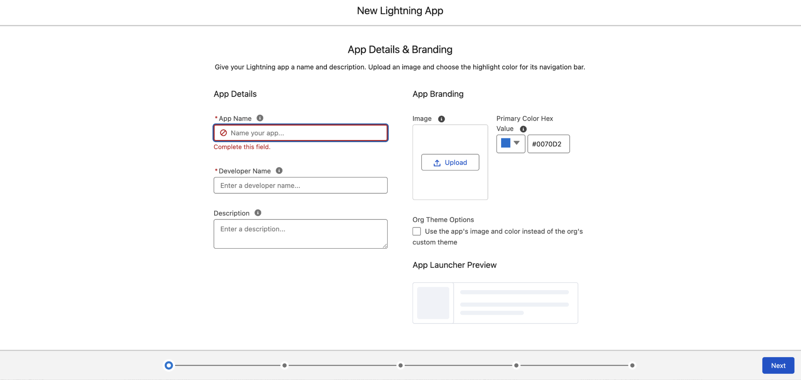

# Sélecteur d’expérience MFE dans Salesforce

Cette rubrique explique comment les clients et les personnes responsables de l’implémentation peuvent déployer et exécuter le micro front-end (MFE) du sélecteur d’expérience [!DNL GenStudio for Performance Marketing] dans une organisation Salesforce. Elle couvre les étapes d’administration (pas de code), les étapes de développement (déploiement et configuration) et les paramètres liés à la sécurité tels que la politique de sécurité du contenu (CSP).

Pour obtenir des options d’intégration MFE génériques, des propriétés de configuration et des exemples de framework, consultez [MFE du sélecteur d’expérience ](experience-selector.md).

## Fonctionnement de cette intégration

>[!VIDEO](https://video.tv.adobe.com/v/3491079?learn=on)

Le composant web Lightning (LWC) charge `sfgsmfe` le bundle UMD du sélecteur d’expérience d’Adobe et le rend dans un `<dialog>` afin que les utilisateurs puissent sélectionner une expérience depuis [!DNL GenStudio for Performance Marketing].

L’intégration peut également :

* **Prévisualiser et décoder :** permet d’afficher la payload sélectionnée au format JSON, l’HTML décodée et un aperçu HTML assaini dans le LWC.
* **Modèles d’e-mail (facultatif) :** un flux **[!UICONTROL Créer un modèle d’e-mail]** dans Salesforce peut appeler Apex (`EmailTemplateController.createEmailTemplate`) pour insérer un enregistrement `EmailTemplate` (HTML, objet et dossier).
* **Chargement au moment de l’exécution :** le script GenStudio est chargé à partir de l’URL hébergée Adobe sur `experience.adobe.com`, et non à partir d’une ressource statique Salesforce dans l’implémentation standard.

## Conditions préalables

* **Organisation Salesforce :** sandbox ou organisation de production dans laquelle vous pouvez déployer des métadonnées et utiliser **[!UICONTROL Lightning App Builder]**.
* **Salesforce CLI :** l’interface de ligne de commande Salesforce (`sf`) est installée et authentifiée, par exemple :

  ```bash
  sf org login web --alias <your-org-alias>
  ```

* **Autorisations :** les utilisateurs qui créent des modèles d’e-mail doivent avoir accès au dossier du modèle d’e-mail cible et disposer des droits pour créer des modèles en fonction des politiques de votre organisation. Apex s&#39;exécute `with sharing`.
* **Adobe/GenStudio :** votre identifiant d’organisation Adobe IMS et votre `clientId` SUSI doivent correspondre à votre configuration Adobe (voir [Configurer les valeurs d’intégration](#configure-integration-values-developer--implementation)).
* **Navigateur/CSP :** Salesforce doit autoriser le chargement de scripts depuis `https://experience.adobe.com` (voir [ Configurer la politique de sécurité du contenu et l’URL d’Adobe](#configure-content-security-policy-and-adobe-url)).

## Déployer le package (développeur)

L’intégration suit une mise en page de style Salesforce DX. Le répertoire de packages par défaut est généralement `force-app` dans votre projet Salesforce DX.

1. À partir de la racine du projet, déployez la source vers l’organisation cible :

   ```bash
   sf project deploy start --source-dir force-app --target-org <your-org-alias>
   ```

2. Vérifiez que le déploiement s’est terminé sans erreur.

Les métadonnées standard de votre projet incluent les éléments suivants :

* Un lot LWC nommé `sfgsmfe` (HTML, JavaScript, CSS et meta XML) qui héberge l’interface utilisateur du sélecteur et le chargement du script.
* Une classe Apex (par exemple, `EmailTemplateController`) qui crée des modèles d’e-mail lorsque vous utilisez ce flux facultatif.

Votre projet peut également définir des ressources statiques. Si le chargeur LWC utilise l’URL du réseau CDN Adobe pour `standalone.js`, ces ressources ne sont pas requises pour ce chemin de chargement, sauf si vous modifiez la mise en œuvre.

## Ajouter le composant à une page Lightning (administrateur)

Le composant `sfgsmfe` est exposé pour :

* Pages d’application Lightning
* Pages d’accueil
* Pages d’enregistrement
* Onglets (en plaçant le composant sur une page Lightning ouverte à partir d’un onglet personnalisé)

Pour ajouter le composant :

1. Dans **[!UICONTROL Configuration]**, ouvrez **[!UICONTROL App Manager]**.
1. Créez une **[!UICONTROL nouvelle application Lightning]** (ou ouvrez une application existante que vous souhaitez étendre).
   {width="80%" zoomable="yes"}
1. Ouvrez l’application et sélectionnez **[!UICONTROL Modifier]**.
   {width="80%" zoomable="yes"}
1. Créez une **[!UICONTROL Nouvelle page]** (ou modifiez une page existante de Lightning).
   {width="60%" zoomable="yes"}
1. Dans **[!UICONTROL Lightning App Builder]**, faites glisser le composant **sfgsmfe** sur la mise en page.
1. **[!UICONTROL Enregistrer]**, **[!UICONTROL Activer]** et affecter la page à l’application Lightning appropriée, aux profils et à la visibilité de l’application afin que les utilisateurs ciblés puissent l’ouvrir.

## Configurer la politique de sécurité du contenu et l’URL d’Adobe

Le LWC injecte une balise `<script>` dont le `src` pointe vers le lot UMD d’Adobe, par exemple :

`https://experience.adobe.com/solutions/GenStudio-experience-selector-mfe/static-assets/resources/@genstudio/experience-selector/umd/standalone.js`

Vous devez configurer Salesforce afin que cette origine soit autorisée pour le chargement des scripts en fonction des paramètres de sécurité CSP et Lightning de votre organisation.

Si le script ne charge pas :

1. Ouvrez les outils de développement du navigateur.
1. Vérifiez les onglets **[!UICONTROL Console]** et **[!UICONTROL Network]** pour les requêtes bloquées ou les violations de CSP.
1. Ajoutez ou ajustez **[!UICONTROL Sites de confiance CSP]** (et tous les paramètres associés à votre version de Salesforce) par `https://experience.adobe.com`, en suivant la documentation Salesforce actuelle pour Lightning.

## Configurer les valeurs d’intégration (développeur/implémentation)

Plusieurs valeurs sont définies dans le LWC JavaScript pour `sfgsmfe`. Les clients les remplacent généralement par environnement.

| Valeur | Description |
| --- | --- |
| `folderId` | ID de dossier Salesforce (`00l...`) pour les modèles d’e-mail dans lesquels de nouveaux modèles sont créés. Obligatoire pour Apex. Le dossier doit exister et être accessible à l’utilisateur en cours d’exécution. |
| `imsOrg` | Identifiant de l’organisation Adobe IMS transmis à `GenStudioExperienceSelector.renderExperienceSelectorWithSUSI`. |
| `susiConfig.clientId` | Identifiant client SUSI Adobe pour l’enregistrement de l’application Experience Selector. |
| `script.src` GenStudio | URL du lot UMD `standalone.js` ; à mettre à jour si Adobe publie un nouveau chemin. |

La création d’un modèle d’e-mail mappe les champs GenStudio au modèle (par exemple, l’objet de `experienceFields`). Ajustez les mappages dans le LWC si votre modèle de contenu diffère.

Pour plus d’informations sur les `renderExperienceSelectorWithSUSI` et les options associées, voir [Propriétés de configuration](experience-selector.md#configuration-properties) dans la rubrique MFE du sélecteur d’expérience .

## Apex : EmailTemplateController

`EmailTemplateController.createEmailTemplate` généralement :

* Valide le nom du modèle, l’ID du dossier et HTML non vide.
* Crée un `EmailTemplate` avec `TemplateType = 'custom'`, `HtmlValue`, `Subject`, `Body` et affectation de dossier.
* Envoie les erreurs au LWC via `AuraHandledException`.

Conseils opérationnels :

* Respectez l’unicité de DeveloperName et les règles de nommage dans l’organisation.
* Vérifiez l’ID du dossier et que l’utilisateur peut créer des enregistrements `EmailTemplate` dans ce dossier.
* Utilisez les journaux de débogage Salesforce lorsque le langage DML ne parvient pas à capturer l’erreur exacte.

## Liste de contrôle de validation

Utilisez cette liste après le déploiement et la configuration :

* [ ] Déploiement s’effectue sans erreur.
* [ ] utilisateurs peuvent ouvrir la page Lightning qui contient les `sfgsmfe`.
* [ ] Le composant n’affiche pas d’erreur de chargement ; l’onglet Réseau renvoie le HTTP 200 par `standalone.js`.
* [ ] **[!UICONTROL Sélectionner une expérience GenStudio]** ouvre le sélecteur et des rappels de sélection s’exécutent.
* [ ] **[!UICONTROL Créer un modèle d’e-mail]** réussit lorsque vous utilisez ce flux et le modèle apparaît sous le dossier configuré dans **[!UICONTROL Configuration]**.

## Voir aussi

* [Sélecteur d’expérience GenStudio MFE](experience-selector.md)
