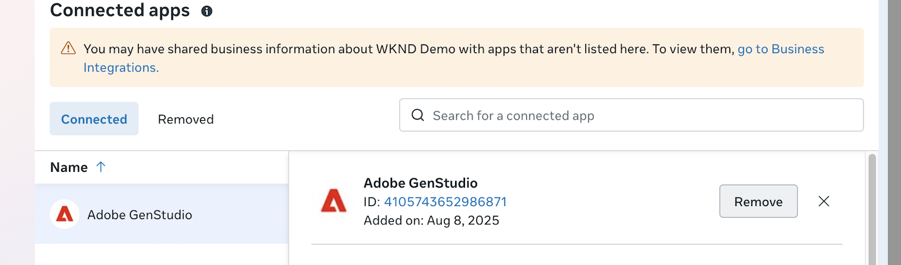

# Connexion à Meta Ads

Cette page explique comment connecter et gérer votre compte de profil Meta Ads vers GenStudio for Performance Marketing afin de gérer les campagnes, d’exporter le contenu et d’accéder aux données publicitaires pour vos campagnes actives.

>[!BEGINSHADEBOX]

**Conditions préalables** :

- Une connexion Facebook/Meta qui peut accéder à tous les services Meta
- _Contrôle total_ sur Meta Business Portfolio et les comptes publicitaires, notamment :
   - Gestion des campagnes
   - Affichage des performances
   - Gestion des maquettes du Hub Creative
   - Analyses avancées
- Désactivez tous les bloqueurs de fenêtres contextuelles dans votre navigateur.
- Vérifiez les associations de pages de compte Instagram dans Meta Business Manager avant de tenter une connexion
- Confirmer l’accès administrateur à toutes les ressources connectées

>[!ENDSHADEBOX]

## Connexion à un compte Meta Ads

1. Cliquez sur **[!UICONTROL Plus]** > **[!UICONTROL Paramètres]**.

1. Dans la section _Connecteurs de données_, cliquez sur **[!UICONTROL Se connecter]** sur la carte _Meta Ads_.

1. Connectez-vous à votre compte Facebook.

   Vous devrez peut-être supprimer les bloqueurs de pop-up, puis utiliser **[!UICONTROL Actualiser]** pour réessayer.

1. Suivez les instructions d’authentification Facebook, vérifiez les informations du compte, puis cliquez sur **[!UICONTROL Continuer comme ...]**

1. Dans _[!UICONTROL Facebook Login for Business]_ (symbole Meta vers Adobe), parcourez les sélections suivantes pour accorder l’accès à GenStudio for Performance Marketing :

   - Sélectionnez un ou plusieurs profils Meta Business et cliquez sur **[!UICONTROL Continuer]**
   - Sélectionnez une ou plusieurs pages Meta, puis cliquez sur **[!UICONTROL Continuer]**
   - Sélectionnez un ou plusieurs comptes Instagram et cliquez sur **[!UICONTROL Continuer]**
   - Vérifiez les sélections et cliquez sur **[!UICONTROL Enregistrer]**

     {width="400" zoomable="yes"}

1. Une fois que vous avez reçu la vérification que votre compte est connecté, cliquez sur **[!UICONTROL Compris]**.

   Cette étape permet à GenStudio for Performance Marketing d’accéder à toutes les publicités, métadonnées et mesures pour des performances optimales.

1. Dans _[!UICONTROL Meta Ads]_, sélectionnez un ou plusieurs comptes à inclure dans [!DNL Insights] et cliquez sur **[!UICONTROL Sélectionner]**.

1. Une fois que vous avez reçu une confirmation _Connecté à Platform_, cliquez sur **[!UICONTROL Afficher les comptes]**.

   La vue _[!UICONTROL Comptes Meta Ads]_ répertorie les `Account name`, `Added by`, `Date added` et `Status`.

   {zoomable="yes"}

Utilisez **[!UICONTROL Ajouter un compte]** pour ajouter d’autres comptes à la liste. Le flux d’autorisation peut différer légèrement lorsque vous ajoutez des comptes liés au même profil Meta Business. Vous sélectionnez uniquement les nouveaux comptes Meta Ads pendant le processus de connexion.

## Connexion à un compte Instagram

>[!IMPORTANT]
>
>Avant d’activer une publicité Meta, assurez-vous dans Meta Business Manager que le compte Instagram que vous souhaitez utiliser est connecté au même compte publicitaire sélectionné lors de l’intégration. Si cette connexion est manquante, le compte Instagram peut ne pas apparaître dans le menu déroulant [!DNL GenStudio for Performance Marketing] _Compte Instagram_ lors de l’activation.

**Pour vérifier ou mettre à jour la connexion au compte Instagram dans Meta Business Manager** :

1. Accédez à **[!UICONTROL Paramètres]**.
1. Sous _Comptes_, sélectionnez **[!UICONTROL Comptes Instagram]**.
1. Choisissez le compte Instagram que vous souhaitez utiliser.
1. Cliquez sur **[!UICONTROL Ressources connectées]**.
1. Sous _Comptes publicitaires_, vérifiez que le compte publicitaire utilisé lors de l’intégration est répertorié.
1. S’il n’est pas répertorié, cliquez sur **[!UICONTROL Connecter des ressources]** et ajoutez le compte publicitaire approprié.

Une fois le compte publicitaire connecté, revenez à [!DNL GenStudio for Performance Marketing] et poursuivez le flux d’activation.

## Bonnes pratiques relatives à la connexion

Pour éviter toute erreur, tenez compte des bonnes pratiques suivantes lors de la configuration des connexions :

- [ ] Commencez par la sélection minimale de ressources (une seule page uniquement) pour la connexion initiale
- [ ] Ajouter des comptes Instagram uniquement après avoir confirmé que l’accès à la page fonctionne
- [ ] Assurez-vous que les comptes Instagram sont correctement associés à la page Facebook sélectionnée dans Meta Business Manager
- [ ] Utiliser une approche par phases : établir d’abord une connexion de base, puis développer les ressources
- [ ] Vérifier les autorisations d’administrateur pour toutes les ressources avant de tenter une connexion

## Déconnexion et dépannage d’une intégration Meta Ads

Il arrive qu’une instance GenStudio for Performance Marketing ne soit pas correctement connectée à un compte Meta Ads. Les configurations les plus courantes pouvant entraîner des problèmes sont les suivantes :

- Un compte Instagram est sélectionné sans sélectionner sa page Facebook associée
- Autorisations révoquées pour un utilisateur qui a effectué la connexion initiale

Dans ce cas, il est préférable de reconnecter le compte publicitaire Meta à l’instance GenStudio for Performance Marketing. Tout d’abord, l’utilisateur doit supprimer l’intégration de l’application directement depuis son Meta Business Manager, ce qui permet de réinitialiser les autorisations. Pour ce faire, un accès administrateur à Meta Business Manager est nécessaire.

Ces étapes effacent les autorisations mises en cache et réinitialisent le flux d’intégration :

1. Accédez à [Meta Business Manager](https://business.facebook.com) en consultant le site web Facebook.
1. Connectez-vous avec votre compte. Le compte doit avoir un accès administrateur au Business Manager.
1. Cliquez sur l’icône représentant un engrenage **[!UICONTROL Paramètres]** dans le coin inférieur gauche pour accéder aux paramètres de Business Portfolio.
1. Dans le menu de gauche, cliquez sur **[!UICONTROL Intégrations]**.
1. Sélectionnez **[!UICONTROL Applications connectées]**. Adobe GenStudio apparaît dans la liste des applications connectées .
   
1. Cliquez sur le nom de l’application.
1. Cliquez sur **[!UICONTROL Supprimer]**.
1. Confirmez la suppression lorsque vous y êtes invité.

Vous pouvez maintenant reconnecter vos comptes publicitaires Meta, profils Instagram et pages Facebook.

## Problèmes de connexion au compte Instagram

Des problèmes peuvent survenir lorsque des comptes Instagram sont sélectionnés sans connecter une page Facebook associée pendant la configuration de la connexion. Cela peut entraîner des erreurs telles que :

- « Impossible de se connecter à {Page_Name} » ou échecs de connexion génériques.
- Délais d’expiration de la connexion pendant la connexion Facebook au flux métier.
- Échecs silencieux lorsque plusieurs ressources sont sélectionnées.
- La connexion échoue lors de la sélection simultanée d&#39;Instagram, de Page et de Compte publicitaire.

### Étapes de résolution :

1. Accédez à [Meta Business Manager](https://business.facebook.com) > Intégrations > Applications connectées.
1. Supprimez l’intégration « Adobe GenStudio » existante, le cas échéant. Cliquez sur **Supprimer**.
1. Revenez à GenStudio et relancez le processus de connexion.
1. Sélectionnez UNIQUEMENT la page Facebook cible lors de la connexion initiale.
1. NE PAS sélectionner le compte Instagram lors de la première tentative de connexion.
1. Vérifiez que la connexion est établie avant d’ajouter d’autres ressources.
1. Une fois la connexion à la page stable, ajoutez les comptes Instagram séparément.
