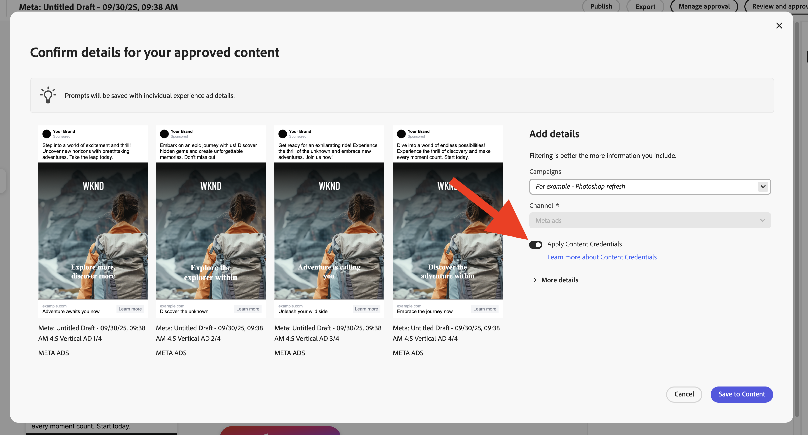

# Content Credentials pour les organisations

Découvrez comment les informations d’identification inviolables pour le contenu qui prouvent l’authenticité de la marque et la conformité du lecteur sont directement intégrées à votre workflow marketing.

>[!WARNING]
>
> Cette fonctionnalité est actuellement en version bêta et n’est disponible que pour les organisations qui ont reçu l’accès. Si vous êtes intéressé, veuillez contacter le représentant de l’équipe en charge de votre compte Adobe ou [utilisez ce lien pour demander une inscription](https://www.feedbackprogram.adobe.com/c/a/5aWPEOthrDv22Mf9CyekOy?source=qr).

## Prise en main de Content Credentials

Une fois Content Credentials activé dans Admin Console, les utilisateurs de GenStudio for Performance Marketing peuvent activer Content Credentials pour toutes les ressources globalement dans l’application. Si l’option globale d’application des informations d’identification est désactivée, les utilisateurs peuvent appliquer Content Credentials pour chaque ressource individuelle.

Une fois le contenu publié, Content Credentials est visible sur les plateformes externes, comme LinkedIn.

Les administrateurs et administratrices sont chargés de charger un certificat X.509 valide dans Admin Console. Cette étape permet de s’assurer que la signature numérique de l’entreprise est correctement configurée et prête à être utilisée dans les applications Adobe DX prises en charge.

>[!NOTE]
>
>Le contrôle de ce paramètre pourrait passer à Admin Console à l’avenir, ce qui rationaliserait la gestion de Content Credentials entre les applications et améliorerait la supervision administrative.

## Que sont les Content Credentials ? 

Les Content Credentials sont un type de métadonnées durable et standard, avec des détails sur la création du contenu et des informations d’identité sur les créateurs et les créatrices. Vous pouvez afficher Content Credentials lorsque le contenu est publié en ligne sur des plateformes de prise en charge ou à l’aide d’outils tels que [l’outil Adobe Inspect](https://contentauthenticity.adobe.com/inspect) ou l’extension de navigateur Adobe Content Authenticity Chrome [&#128279;](https://helpx.adobe.com/creative-cloud/help/cai/adobe-content-authenticity-chrome-browser-extension.html).  

L’application de Content Credentials peut aider à accroître la transparence sur la création du contenu et peut aider vos utilisateurs à se connecter à leur contenu.

[En savoir plus sur Content Credentials](https://helpx.adobe.com/fr/creative-cloud/help/content-credentials.html) sur Adobe.

## Signature de marque et suivi des ressources

Le contenu signé par la marque joue un rôle important dans la promotion de l’intégrité de la marque et de la confiance des utilisateurs. Les entreprises peuvent signer leur contenu avec une signature de marque unique dans les applications Adobe lorsque leur certificat est correctement configuré dans Admin Console. Cette assurance d’authenticité est maintenue à l’aide de technologies de filigrane et d’empreinte digitale invisibles, qui permettent de préserver la durabilité de la signature tout au long du cycle de vie du contenu.

Outre la signature de marque, les entreprises peuvent joindre des identifiants de ressource directement à leur contenu. Cela facilite le suivi efficace des ressources, en particulier lorsqu’elles sont partagées ou publiées sur des plateformes de médias sociaux. En incorporant des identifiants de ressources, les entreprises peuvent retracer l’origine et le chemin de distribution de leur contenu, ce qui renforce la surveillance et la responsabilité.

## Content Credentials dans le workflow marketing

L’application de Content Credentials peut être réalisée tout au long du workflow marketing, directement dans GenStudio for Performance Marketing, depuis l’importation et la découverte de contenu jusqu’à l’activation et l’exportation. Vous trouverez également des informations d’identification affichées sur le contenu pour révision dans l’application.

### Import et découverte

Dans la galerie de contenu, les informations d’identification s’affichent sur les ressources importées.

Le badge Content Credential dans le coin supérieur droit de la miniature indique le contenu « Signé par la marque ».

La sélection du contenu signé affiche les métadonnées détaillées : marque publiée, enregistreur, outil utilisé, date et heure.

Le contenu peut être filtré par statut d’identification.

### Création et sélection

Les badges Content Credential s’affichent dans le sélecteur de ressources de la zone de travail.

Les métadonnées d’identification sont conservées lorsque des ressources sont sélectionnées pour que les expériences conservent la chaîne de provenance tout au long de la modification.

### Edition et transformation

Lors des exportations à partir d’un brouillon, les ressources modifiées sont automatiquement resignées et les nouvelles informations d’identification sont liées à l’original.

{width="60%"}

### Révision et approbation

Dans l’aperçu Réviser et approuver , le statut des informations d’identification s’affiche pour les ressources sur le rail de droite.

{width="60%"}

Les informations d’identification par variante s’affichent lorsque les réviseurs inspectent les ressources. Les expériences approuvées sont resignées lorsque les utilisateurs cliquent sur **[!UICONTROL Enregistrer dans le contenu]**.

### Activation et export

Pendant l’activation, le statut des informations d’identification s’affiche dans le sélecteur d’expérience.

{width="60%"}

Les fichiers exportés auront des informations d’identification conformes au C2PA incorporées.

L’intégrité des informations d’identification est préservée dans tous les formats pris en charge (JPEG, PNG, MP4).

