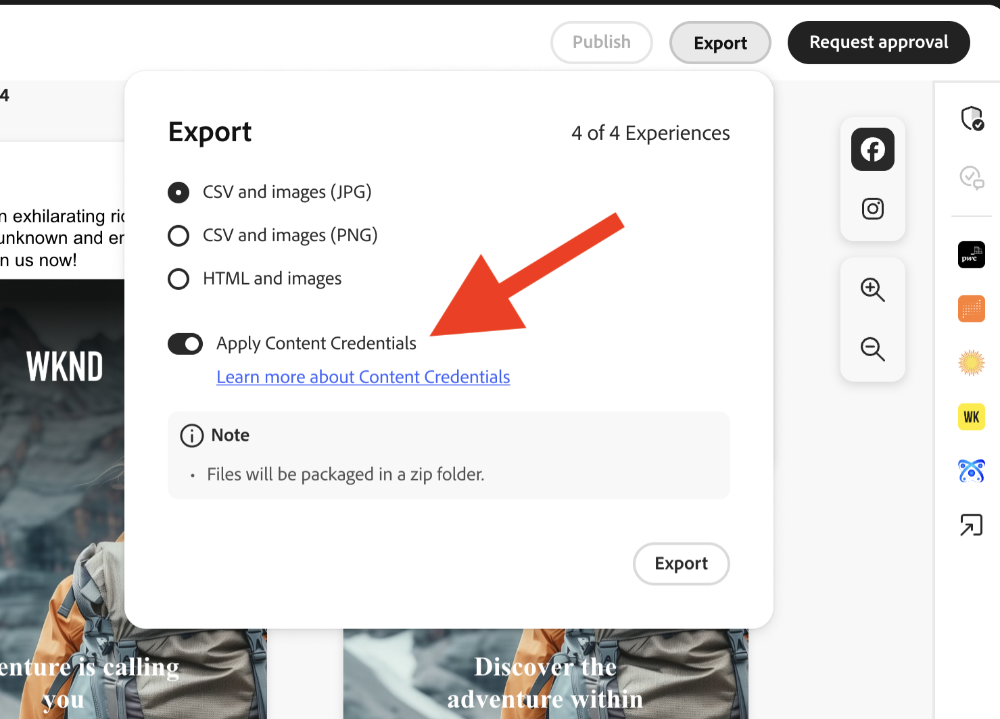
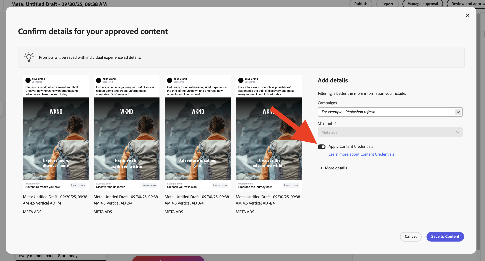

# Content Credentials pour les organisations

Découvrez comment les informations d’identification inviolables pour le contenu qui prouvent l’authenticité de la marque et la conformité du lecteur sont directement intégrées à votre workflow marketing.

>[!WARNING]
>
> Cette fonctionnalité est actuellement en version bêta et n’est disponible que pour les organisations qui ont reçu l’accès. Si vous êtes intéressé, veuillez contacter le représentant de l’équipe en charge de votre compte Adobe ou [utilisez ce lien pour demander une inscription](https://www.feedbackprogram.adobe.com/c/a/5aWPEOthrDv22Mf9CyekOy?source=qr).

## Prise en main de Content Credentials {#content-credentials}

>[!CONTEXTUALHELP]
>id="gspm_content_credentials"
>title="Content Credentials dans [!DNL GenStudio for Performance Marketing]"
>abstract="Les informations d’identification inviolables pour le contenu qui prouvent l’authenticité de la marque et la conformité du lecteur peuvent être directement intégrées à votre workflow marketing."

Une fois Content Credentials activé dans Admin Console, les utilisateurs de GenStudio for Performance Marketing peuvent activer Content Credentials pour toutes les ressources globalement dans l’application. Si l’option globale d’application des informations d’identification est désactivée, les utilisateurs peuvent appliquer Content Credentials pour chaque ressource individuelle.

Une fois le contenu publié, Content Credentials est visible sur les plateformes externes, comme LinkedIn.

Les administrateurs et administratrices sont chargés de charger un certificat X.509 valide dans Admin Console. Cette étape permet de s’assurer que la signature numérique de l’entreprise est correctement configurée et prête à être utilisée dans les applications Adobe DX prises en charge.

>[!NOTE]
>
>Le contrôle de ce paramètre pourrait passer à Admin Console à l’avenir, ce qui rationaliserait la gestion de Content Credentials entre les applications et améliorerait la supervision administrative.

## Que sont les Content Credentials ? 

Les Content Credentials sont un type de métadonnées durable et standard, avec des détails sur la création du contenu et des informations d’identité sur les créateurs et les créatrices. Vous pouvez afficher Content Credentials lorsque le contenu est publié en ligne sur des plateformes de prise en charge ou à l’aide d’outils tels que [l’outil Adobe Inspect](https://contentauthenticity.adobe.com/inspect) ou l’extension de navigateur Adobe Content Authenticity Chrome [&#128279;](https://helpx.adobe.com/fr/creative-cloud/help/cai/adobe-content-authenticity-chrome-browser-extension.html).  

L’application de Content Credentials peut aider à accroître la transparence sur la création du contenu et peut aider vos utilisateurs à se connecter à leur contenu.

[En savoir plus sur Content Credentials](https://helpx.adobe.com/fr/creative-cloud/help/content-credentials.html) sur Adobe.

## Signature de marque et suivi des ressources

Le contenu signé par la marque joue un rôle important dans la promotion de l’intégrité de la marque et de la confiance des utilisateurs. Organizations can sign their content with a unique brand signature in Adobe applications when their certificate is properly configured in the Admin Console. This assurance of authenticity is maintained using invisible watermarking and fingerprinting technologies, which help preserve the durability of the signature throughout the content&#39;s lifecycle.

In addition to brand signing, enterprises can attach asset IDs directly to their content. This facilitates efficient tracking of assets, particularly when they are shared or posted on social media platforms. By incorporating asset IDs, organizations can trace the origin and distribution path of their content, enhancing oversight and accountability.

## Content Credentials in the marketing workflow

Applying Content Credentials can be done throughout the marketing workflow directly in GenStudio for Performance Marketing, from import and content discovery to activation and export. You&#39;ll also find credentials displayed on content for review throughout the app.

### Import and discovery

In the Content gallery, credentials are displayed on imported assets.

The Content Credential badge in the upper right corner of the thumbnail indicates &quot;Brand signed&quot; content.

Selecting signed content displays the detailed metadata: published brand, recorder, tool used, timestamp.

Content can be filtered by credential status.

### Creation and selection

Content Credential badges are shown in the Canvas asset selector.

Credential metadata is preserved as assets are selected for experiences to maintain the provenance chain throughout editing.

### Editing and transformation

During exports from a draft, modified assets are automatically re-signed and the new credential links to the original.

{width="60%"}

### Review and approval

In the Review and Approve preview, credential status is displayed for assets on the right rail.

{width="60%"}

Les informations d’identification par variante s’affichent lorsque les réviseurs inspectent les ressources. Les expériences approuvées sont resignées lorsque les utilisateurs cliquent sur **[!UICONTROL Enregistrer dans le contenu]**.

### Activation et export

Pendant l’activation, le statut des informations d’identification s’affiche dans le sélecteur d’expérience.

{width="60%"}

Les fichiers exportés auront des informations d’identification conformes au C2PA incorporées.

L’intégrité des informations d’identification est préservée dans tous les formats pris en charge (JPEG, PNG, MP4).

