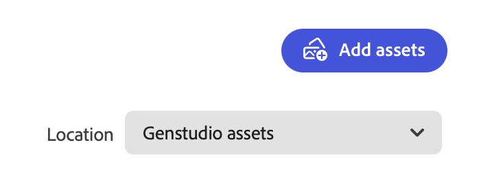

# Gestion des ressources et des expériences

Adobe GenStudio for Performance Marketing [!DNL Content] simplifie et améliore la gestion des ressources approuvées par la marque pour une utilisation et une réutilisation dans votre parcours de marketing numérique.

## Galerie de contenu

La galerie affiche un inventaire des ressources, expériences ou modèles approuvés en fonction de la vue sélectionnée. L’icône de filtre (entonnoir) située au-dessus du côté gauche du tableau ouvre le menu **[!UICONTROL Filtre]**, dans lequel vous pouvez sélectionner de nombreuses catégories pour filtrer le contenu affiché dans la galerie. Dans la vue _[!UICONTROL Assets]_, cliquez sur l’icône de recherche (loupe) pour utiliser un mot-clé afin de trouver une ressource.

Vous trouverez ci-dessous une recherche sur le terme `dog` dans la galerie [!UICONTROL Assets] :

### Recherche de contenu

L’interface de filtrage et de recherche est rapide et réactive et offre une expérience de recherche productive axée sur la recherche. Chaque vue [!DNL Content] fournit des options de filtre pour affiner votre recherche pour la ressource, l’expérience ou le modèle idéal. Pour les ressources et les expériences, vous pouvez sélectionner une campagne et des consignes spécifiques, telles que le contenu créé pour un produit spécifique.

Il existe des filtres basés sur [keywords](asset-details.md#user-defined-metadata) et [catégories d’attributs](/help/user-guide/insights/attribute-category.md) pour limiter les résultats de la recherche. Par exemple, vous pouvez rechercher une ressource d’un type de fichier ou d’un objet spécifique afin de vous aider à créer une nouvelle expérience pour votre campagne.

Lors de la recherche de _expériences_, vous pouvez utiliser le filtre **[!UICONTROL Créé par]** pour limiter la liste afin de n’afficher que les expériences créées par vous ou une personne spécifique.

**Pour rechercher du contenu à réutiliser** :

1. Dans _[!DNL Content]_, sélectionnez la section **[!UICONTROL Assets]**.

1. Sélectionnez un référentiel de ressources dans la liste **[!UICONTROL Location]** ou vérifiez que vous examinez le référentiel de ressources approprié. `GenStudio assets` est le référentiel par défaut.

   >[!IMPORTANT]
   >
   >La liste _Location_ n’est disponible que lorsque vous [vous connectez à un référentiel AEM](connect-aem-repo.md).

1. Cliquez sur **[!UICONTROL Rechercher]** (loupe) pour saisir un mot-clé ou une description.

1. Limitez votre recherche en sélectionnant une catégorie dans la liste _[!UICONTROL Filtre]_. Par exemple, si vous recherchez un fichier PNG, cliquez sur **[!UICONTROL Format du fichier]** et choisissez **PNG**.

   Plus vous limitez votre recherche, moins il y a d’options de filtrage disponibles. Cliquez sur **[!UICONTROL Effacer tout]** pour supprimer tous les filtres.

1. Sélectionnez une ressource pour une vue complète et une liste de détails.

   Cliquez sur **[!UICONTROL Télécharger]** (flèche vers le bas) pour utiliser la ressource dans votre poste de travail local.

### Emplacement

Par défaut, les ressources que vous ajoutez à [!DNL Content] par le biais du processus [!DNL Create] ou par le transfert sont stockées dans le référentiel `GenStudio assets`. Le référentiel `GenStudio assets` est un référentiel de lecture-écriture dans GenStudio for Performance Marketing. Cela signifie que vous pouvez enregistrer, modifier et supprimer des ressources dans le référentiel `GenStudio assets`.

La liste **[!UICONTROL Location]** située au-dessus de la galerie _[!UICONTROL Assets]_ sur le côté droit vous permet de sélectionner des référentiels Adobe Experience Manager (AEM) [!DNL Assets Content Hub] connectés.

{width="350"}

Lorsque vous sélectionnez un référentiel AEM, la galerie affiche un inventaire des ressources de ce référentiel, ce qui vous permet d’exploiter les ressources approuvées de ces référentiels en tant qu’entrées pour la création de contenu. Les options de filtre changent pour refléter les catégories configurées dans [!DNL AEM Assets Content Hub].

Voir [Connexion d’un référentiel d’AEM](connect-aem-repo.md) pour plus d’informations sur l’ajout de votre référentiel [!DNL AEM Assets Content Hub] à GenStudio for Performance Marketing.

Le référentiel AEM est en lecture seule, ce qui signifie que vous pouvez accéder au contenu, mais que vous ne pouvez pas enregistrer de brouillons, de nouvelles ressources ou de métadonnées dans le référentiel AEM. Tous les brouillons et mises à jour finales pour les ressources, les expériences et les modèles sont enregistrés dans le référentiel `GenStudio assets` avec de nouvelles [métadonnées système](asset-details.md#system-metadata).

{{note-aem-assets}}

## Gestion d’Assets

Dans [!UICONTROL Contenu], le marketing de performance peut facilement stocker, récupérer et gérer leurs ressources numériques. En exploitant à la fois le référentiel `GenStudio assets` et les référentiels AEM, les utilisateurs peuvent s’assurer que leurs ressources sont bien organisées et accessibles pour diverses campagnes marketing. Cette approche multi-référentiel offre une flexibilité et un contrôle sur l’utilisation des ressources dans tous les environnements, en s’assurant que seules les ressources approuvées et à jour sont utilisées dans les efforts marketing.

### Ajouter des ressources

Lors de l’ajout de ressources à [!DNL Content], elles sont par défaut stockées dans le référentiel `GenStudio assets`. Le bouton _[!UICONTROL Ajouter des ressources]_ n’est disponible que lorsque l’ _[!UICONTROL emplacement]_ est le référentiel `GenStudio assets`.

{width="350"}

**Pour ajouter une ou plusieurs ressources** :

1. Dans _[!DNL Content]_, cliquez sur **[!UICONTROL Ajouter des ressources]**.

1. Dans la vue _Ajouter vos ressources approuvées_, déposez un ou plusieurs fichiers dans l’espace de dépôt. Vous pouvez éventuellement effectuer une sélection à partir de fichiers locaux à l’aide de **[!UICONTROL Parcourir]** ou importer des fichiers à partir de Dropbox ou Microsoft OneDrive.

1. Dans la section _Ajouter des détails_ , sélectionnez un **[!UICONTROL nom de campagne]** ou saisissez un nouveau nom.

1. Pour améliorer la visibilité, ajoutez des détails facultatifs tels que _Nom de la marque_, _Personas_, _Région_ et _Mots-clés_ dans la section **Plus de détails**.

   Plus vous fournissez de détails, plus vous découvrez les puissantes fonctionnalités de GenStudio for Performance Marketing. Sélectionnez un ou plusieurs détails dans la liste ou saisissez-en un nouveau le cas échéant, par exemple avec des mots-clés. Chaque détail que vous ajoutez apparaît sous la liste. Cliquez sur **`x`** pour supprimer un détail.

   Tous les détails que vous ajoutez s’appliquent à toutes les ressources ajoutées dans cette action.

   Voir [Détails des métadonnées](/help/user-guide/content/asset-details.md#system-metadata).

1. Cliquez sur **[!UICONTROL Ajouter des ressources]**.

1. Une fois le chargement de la ressource terminé, cliquez sur **Terminé**.

1. Pour afficher vos nouvelles ressources chargées, cliquez sur **[!UICONTROL Actualiser]** dans la notification _Nouvelles ressources disponibles_ située au bas de la zone de travail.

<!--
In the future, need guidance on template upload errors. For now, the UI just says error.
-->

### Télécharger des ressources

**Pour télécharger une ressource** :

1. Dans _[!DNL Content]_, sélectionnez une ressource image. Cliquer sur une ressource ouvre une vue sélectionnée de la ressource.

1. Dans la vue de la ressource, cliquez sur l’icône **[!UICONTROL Télécharger]** (flèche pointant vers le bas) en haut à droite.

1. Le téléchargement commence à placer une copie de la ressource à l’emplacement de téléchargement par défaut.

### Suppression des ressources

**Pour supprimer une ressource** :

1. Dans _[!DNL Content]_, sélectionnez une ressource image. Cliquer sur une ressource ouvre une vue sélectionnée de la ressource.

1. Dans la vue de ressource, cliquez sur **[!UICONTROL Supprimer]** (corbeille) en haut à droite.

1. Dans la fenêtre contextuelle _Supprimer la ressource_, vérifiez la ressource et cliquez sur **[!UICONTROL Supprimer]**.

## Modifier dans Express

Vous pouvez modifier des ressources d’image (JPG ou PNG) directement dans GenStudio for Performance Marketing à l’aide d’Adobe Express. Le canevas _[!UICONTROL Powered by Adobe Express]_ offre des fonctionnalités pratiques pour améliorer vos images sans quitter l’application GenStudio. Vous pouvez facilement supprimer des arrière-plans, appliquer des remplissages génératifs, ajuster les effets et recadrer des images.

>[!BEGINSHADEBOX]

Critères d&#39;amélioration des images avec la fonction [!DNL Edit in Adobe Express] :

- Les types MIME pris en charge sont `image/png` et `image/jpeg`
- Les dimensions d’image minimales sont de 50 x 50 pixels.
- Les dimensions d’image maximales sont de 8 000 x 8 000 pixels.
- La taille maximale est de 40 Mo (40 000 000 octets)

>[!ENDSHADEBOX]

**Pour modifier une ressource avec Express** :

1. Dans _[!DNL Content]_, sélectionnez une ressource image. Cliquer sur une ressource ouvre une vue sélectionnée de la ressource.

1. Dans la vue de la ressource, cliquez sur l&#39;icône **[!UICONTROL Modifier en Adobe Express]** en haut à droite.

1. Dans la zone de travail _[!UICONTROL Powered by Adobe Express]_, utilisez les commandes express du panneau de gauche pour améliorer votre image.

1. Lorsque vous êtes satisfait de l’image mise à jour, cliquez sur **[!UICONTROL Enregistrer une copie]** dans le coin supérieur droit.

1. Sélectionnez le format de fichier (JPG ou PNG) et cliquez sur **[!UICONTROL Enregistrer une copie]**.

1. Dans la fenêtre contextuelle _[!UICONTROL Enregistrer une copie de la ressource]_, mettez à jour le **[!UICONTROL nom de la ressource]**.

   - Sélectionnez **[!UICONTROL Même détails que la ressource d’origine]** pour transférer les détails de la ressource vers la nouvelle image.

   - Développez la section **[!UICONTROL Plus de détails]** pour mettre à jour les instructions et d’autres métadonnées.

   >[!TIP]
   >
   >Plus vous fournissez de détails, plus vous découvrez les puissantes fonctionnalités de GenStudio for Performance Marketing. Sélectionnez un ou plusieurs détails dans la liste ou saisissez-en un nouveau le cas échéant, par exemple avec des mots-clés. Chaque détail que vous ajoutez apparaît sous la liste. Cliquez sur **`x`** pour supprimer un détail.

1. Cliquer sur **[!UICONTROL Enregistrer]**.
