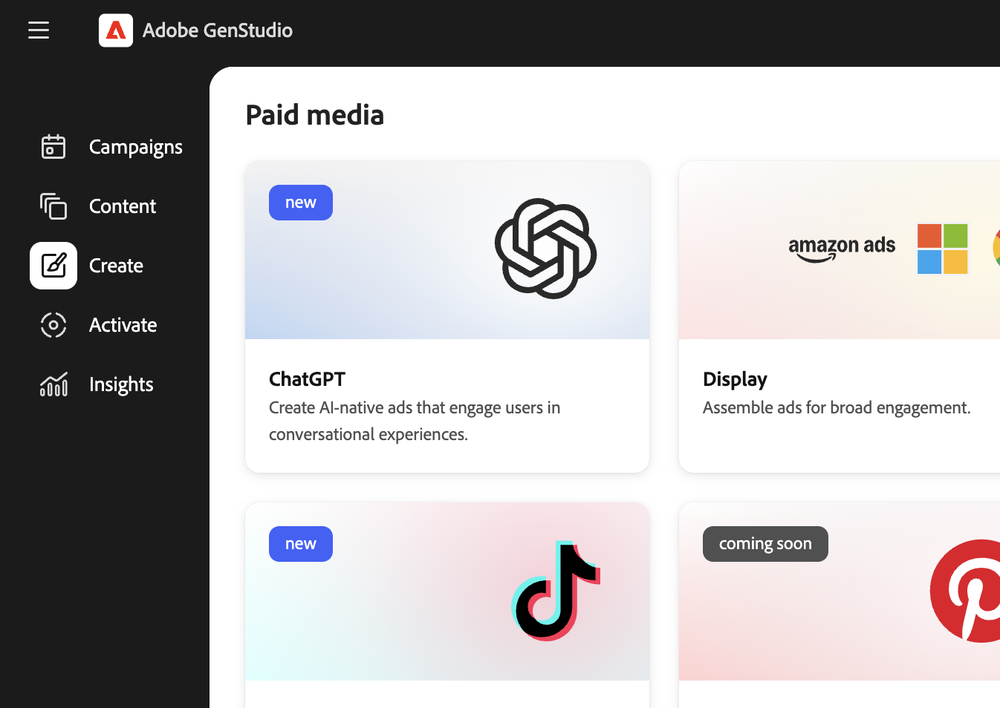

# Créer une expérience d’annonce ChatGPT

Utilisez [[!DNL Create]](/help/user-guide/create/overview.md) dans [!DNL GenStudio for Performance Marketing] pour créer des annonces **ChatGPT** sous forme d’expériences de médias payants, depuis les directives et les ressources jusqu’à la génération, la vérification des marques et des canaux, l’approbation, la publication sur [!DNL Content] et l’activation dans le même flux de [!DNL Activate] que celui utilisé pour les canaux tels que Meta et Google Campaign Manager 360.

Avant de commencer, [ajoutez des instructions](/help/user-guide/guidelines/add-guidelines.md) si nécessaire, puis passez en revue [invites efficaces](/help/user-guide/effective-prompts.md) afin que vos invites principales produisent des variantes fortes.

## Conditions préalables

Vous devrez être configuré conformément à ces conditions préalables avant de créer ou d&#39;activer des annonces ChatGPT dans [!DNL GenStudio for Performance Marketing].

### Accès et rôles

* Vous disposez d’un rôle **Éditeur** ou supérieur dans [!DNL GenStudio for Performance Marketing]. Voir [Rôles utilisateur et autorisations](/help/user-guide/user-roles.md).
* Vous disposez d’un **compte publicitaire OpenAI** et d’une **clé API** à partir de ce compte.
* Un compte **ChatGPT Ads** est connecté à [!DNL GenStudio for Performance Marketing].

Pour créer une clé API dans OpenAI Ads Manager :

1. Dans OpenAI Ads Manager, accédez à **[!UICONTROL Paramètres]** > **[!UICONTROL Clés API]** > **[!UICONTROL Créer une clé]**.

Pour connecter votre compte ChatGPT Ads à [!DNL GenStudio for Performance Marketing] :

1. Dans la zone inférieure gauche, cliquez sur **[!UICONTROL Plus]** > **[!UICONTROL Paramètres]** > **[!UICONTROL ChatGPT]** > **[!UICONTROL Se connecter]** > **[!UICONTROL Ajouter un compte]**.
1. Saisissez le nom de votre compte publicitaire OpenAI, collez votre clé API, puis cliquez sur **[!UICONTROL Ajouter un compte]**.

Votre compte publicitaire est connecté une fois le flux terminé.

### Créer une configuration

* **[!DNL Brands]**, **[!DNL Products]** et **[!DNL Personas]** sont configurés de sorte que l’application puisse générer une copie sur la marque. Voir [Présentation des directives](/help/user-guide/guidelines/overview.md).
* Les images que vous souhaitez utiliser sont disponibles dans [[!DNL Content]](/help/user-guide/content/overview.md).

## Générer une annonce ChatGPT

Vous créez des annonces ChatGPT en tant qu’expériences média payantes dans l’espace de travail [!DNL Create].

### Démarrer une expérience ChatGPT

Pour ouvrir la création de ChatGPT :

1. Accédez à **[!UICONTROL Créer]** > **[!UICONTROL ChatGPT]**. Vous ne sélectionnez pas de modèles pour le ChatGPT ; une seule disposition d’annonce est utilisée.
   {width="60%"}
1. Dans la _Zone de travail_, effectuez des sélections pour **[!DNL Brand]**, **[!DNL Product]**, **[!DNL Persona]** et **Langue**.
1. Sélectionnez une image dans [!DNL Content].
1. Entrez une invite pour votre copie de titre de ChatGPT.
1. Cliquez sur **[!UICONTROL Générer]**.

[!DNL GenStudio for Performance Marketing] **génère quatre variantes créatives**

Vous pouvez :

* Utilisez **[!UICONTROL Régénérer]** ou **[!UICONTROL Affiner]** pour ajuster la tonalité, la longueur ou l’accentuation.
* Modifiez le texte directement dans la _Zone de travail_.
* Utilisez **[!UICONTROL Swap]** pour choisir une autre image dans [!DNL Content].

Consultez [Gérer les variantes](/help/user-guide/create/manage-variants.md) pour découvrir d’autres façons de modifier les expériences générées.

### Exécuter des vérifications de marque et de canal

Avant d’enregistrer ou d’envoyer l’expérience pour révision, validez la copie et la mise en page par rapport aux règles de marque et de canal.

Pour exécuter des vérifications de contenu :

1. Cliquez sur **[!UICONTROL Vérification du contenu]** (vérifications de marque et de canal).
1. Consultez les résultats de la validation dans le panneau [_Vérification de contenu_](/help/user-guide/guidelines/brand-validation.md#content-check-panel).
1. Résolvez les problèmes signalés (par exemple, la longueur de la copie ou le texte dense à l’écran) en modifiant les variantes ou en effectuant une régénération si nécessaire.

Consultez [Validation de la marque](/help/user-guide/guidelines/brand-validation.md).

## Enregistrer une annonce publicitaire ChatGPT dans [!DNL GenStudio for Performance Marketing]

L’enregistrement déplace votre expérience publicitaire ChatGPT vers [!DNL Content] afin qu’elle puisse être examinée, réutilisée et activée.

Il existe deux états :

* **Projet d&#39;expérience** : travail en cours et non approuvé.
* **Expérience publiée** : approuvée et disponible en [!DNL Content] pour activation.

### Envoyer pour révision

1. Dans l’en-tête de l’expérience, cliquez sur **[!UICONTROL Demander une révision]**.
1. Sélectionnez les approbateurs (par exemple, les parties prenantes de la marque, du service juridique ou des performances).
1. Facultatif : ajoutez une note dans **[!UICONTROL Paramètres]**.
1. Cliquez sur **[!UICONTROL Envoyer pour révision]**.

Les approbateurs peuvent afficher l’expérience ChatGPT, les résultats de vérification de la marque et du canal, ainsi que les **[!UICONTROL Approuver]** ou demander des modifications.

Voir [Demande de révision et d’approbation](/help/user-guide/approvals/request-review.md) et [Révisions et approbations](/help/user-guide/approvals/overview.md).

### Publier dans le contenu

Après toutes les approbations requises, publiez sur [!DNL Content] :

1. Cliquez sur **[!UICONTROL Publier dans le contenu]**.
1. Confirmez les métadonnées, par exemple le nom de la campagne ou de l’activation, la région, la langue, le persona, l’étape funnel et **Canal : ChatGPT**.
1. Cliquez sur **[!UICONTROL Publier]**.

L’annonce ChatGPT apparaît en [!DNL Content], détectable avec des filtres tels que le canal ou la campagne, et est prête à être sélectionnée en [!DNL Activate].

Voir [Publication du contenu approuvé](/help/user-guide/approvals/publish-content.md) et [[!DNL Content] présentation](/help/user-guide/content/overview.md).

## Activer une annonce ChatGPT

L&#39;activation de ChatGPT utilise le même module [[!DNL Activate]](/help/user-guide/activation/overview.md) que les autres canaux payants. Consultez [Activer une annonce ChatGPT](/help/user-guide/activation/activate-chatgpt-ad.md) pour connaître les conditions préalables et les champs de configuration spécifiques à ChatGPT.
