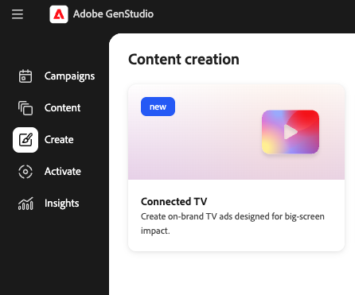

# Création d’une expérience TV connectée

Utilisez [[!DNL Create]](/help/user-guide/create/overview.md) dans [!DNL GenStudio for Performance Marketing] pour créer des annonces de télévision connectée (CTV) à un seul endroit, à partir de directives brèves et partagées jusqu’à la génération, le raffinement basé sur la scène, l’approbation et l’exportation prête pour l’éditeur. Le workflow ci-dessous s’exécute entièrement dans [!DNL GenStudio for Performance Marketing] ; il n’existe aucune application CTV distincte ni aucun éditeur intégré.

## Conditions préalables

Avant de créer une publicité CTV, vérifiez les points suivants :

* Accès à [!DNL GenStudio for Performance Marketing].
* **[!DNL Brands]**, **[!DNL Products]** et **[!DNL Personas]** configurés en tant qu’objets partagés dans [!DNL GenStudio for Performance Marketing]. Consultez [ Présentation des directives ](/help/user-guide/guidelines/overview.md) pour comprendre comment ces objets informent la génération.
* Les ressources de Campaign (clips vidéo, images, logos, musique) sont recommandées, mais ne sont pas requises. L’IA générative peut combler les vides lorsque les ressources sont manquantes ou incomplètes.

## Créer une nouvelle publicité CTV

Tout ce qui se passe dans ce workflow se passe dans [!DNL GenStudio for Performance Marketing].

{width="50%"}
**Pour accéder à la création de CTV** :

1. Connectez-vous à [!DNL GenStudio for Performance Marketing].
1. Depuis la surface d’accueil ou de création, accédez à **[!UICONTROL Créer]**.
1. Sélectionnez **CTV** à l’aide de la carte Création de CTV .
1. Cliquez sur **[!UICONTROL Créer une publicité CTV]**.

Une expérience de création de CTV unique et rationalisée s’ouvre. Vous n’êtes pas tenu de choisir d’abord un type d’annonce.

## Configurer le brief

Le résumé et les entrées déterminent la manière dont la publicité est générée. C’est l’occasion pour vous de fournir le contexte et les contraintes du processus de génération publicitaire.

{width=80% » align=« center »}

**Pour configurer le brief** :

1. Sélectionnez **[!DNL Brands]**, **[!DNL Products]** et **[!DNL Personas]** parmi vos objets partagés existants.
1. Ajoutez le **briefing de création** en le saisissant directement ou en le chargeant. Incluez l’objectif de la campagne, le message clé et les contraintes.
1. Définissez **durée de l’annonce publicitaire** sur 15 ou 30 secondes.
1. Vous pouvez éventuellement ajouter des **ressources**. Chargez des clips vidéo, des images, des logos, de la musique, des voix off ou des cartes d’introduction et de sortie (par glisser-déposer ou sélection de fichier), ou choisissez des ressources dans votre référentiel [!DNL Content].
1. Cliquez sur le bouton **[!UICONTROL Générer]**.

Si les ressources sont manquantes ou incomplètes, [!DNL GenStudio for Performance Marketing] pouvez générer des scènes manquantes, de la musique ou des voix off à l’aide de l’IA. Assets que vous fournissez a toujours la priorité sur le matériel généré.

[!DNL GenStudio for Performance Marketing] automatiquement :

* Interprète le résumé avec le contexte à partir de **[!DNL Brands]**, **[!DNL Products]** et **[!DNL Personas]**.
* Assemble une structure publicitaire CTV complète.
* Crée des scènes, des superpositions de texte, de la musique et des voix off selon les besoins.
* Applique une durée et un formatage conformes au CTV.

Le résultat est une publicité CTV entièrement formée et prévisualisable, et non une chronologie de brouillon vide.

## Modifier et affiner la publicité

Utilisez l’éditeur basé sur les scènes pour affiner la publicité sans tout régénérer.

Cliquez sur une scène dans la bande de la scène pour l&#39;ouvrir afin de la modifier. Les modifications que vous pouvez effectuer sont les suivantes :

* Remplacer ou régénérer une scène unique avec l’IA.
* Modifiez l’invite de la scène pour créer des variantes.
* Réorganiser ou rogner des scènes.
* Modifiez les superpositions de texte.
* Échangez, mettez en sourdine ou remplacez la musique et la voix off.
* Ajustez les transitions entre les scènes.

La modification de la portée vous permet de régénérer une scène à la fois pour une itération plus rapide et une actualisation créative.

>[!NOTE]
>
>L’éditeur ne prend pas en charge la modification d’objets *à l’intérieur* d’un clip vidéo (par exemple, la suppression d’éléments, la modification des couleurs de produits ou la modification de l’apparence des personnes).

## Vérifier et approuver

Envoyez l’annonce publicitaire pour révision de marque à l’aide de vos workflows d’approbation intégrés. Les réviseurs de la marque et des parties prenantes vérifient la conformité des messages, des visuels et de la marque. Les approbateurs valident l’annonce publicitaire et ne sont pas censés effectuer de montage vidéo à la place du marketeur.

## Export

Après approbation, vous pouvez :

* Exportez l’annonce CTV finalisée dans un format compatible et prêt pour l’éditeur.
* Enregistrez à nouveau la publicité sur [!DNL Content].
* Utilisez-le dans les workflows d’achat et de trafic de CTV en aval.

Creative est conçu pour être prêt à être activé sans recodage ni reprise.
