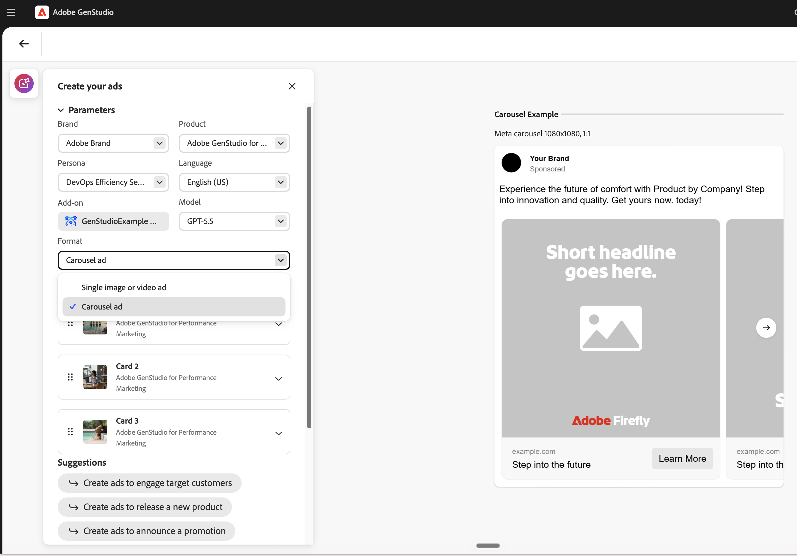

# Création d’une expérience publicitaire de carrousel Meta

Une annonce publicitaire de carrousel Meta est un format d’annonce publicitaire payante qui affiche deux à dix cartes glissables, chacune ayant sa propre image ou vidéo, son propre titre et son propre lien.

Cette page décrit les étapes spécifiques aux annonces publicitaires de carrousel. Pour les étapes partagées que cette page ne répète pas, telles que le choix d’un modèle, l’ajout de paramètres, la révision de variantes et la publication, voir [Création d’une expérience d’annonce Meta](/help/user-guide/create/create-meta-ad.md).

## Conditions préalables

Avant de créer une annonce publicitaire de carrousel, assurez-vous d’avoir un modèle dont les pages partagent toutes un rapport d’aspect, soit 1:1 soit 4:5. Chaque page de modèle devient une carte. Pour plus d&#39;informations, consultez les [directives relatives aux modèles de publicité ](/help/user-guide/templates/meta-template.md).

## Choisir le format du carrousel

Après avoir sélectionné un modèle et ouvert la zone de travail, choisissez le format du carrousel dans le tiroir d’invite.

1. Dans le panneau _[!DNL Create your ads]_, développez_[!UICONTROL  Paramètres ]_.
1. Dans le menu déroulant **[!UICONTROL Format]**, sélectionnez **[!UICONTROL Annonce carrousel]**.

   {width="70%" zoomable="yes"}

Si vous commencez à partir d’un modèle d’une seule page, [!DNL GenStudio for Performance Marketing] duplique la page pour répondre à la norme minimale de deux cartes. Si les pages du modèle ne partagent pas toutes le même format, le commutateur de format est bloqué jusqu’à ce que vous utilisiez un modèle avec un format cohérent.

## Gérer les cartes

Créez le jeu de cartes dans le tiroir d’invite avant de générer. Pour ajouter d’autres cartes, dupliquez une carte existante.

* **Pour dupliquer une carte**, sélectionnez **[!UICONTROL Dupliquer]** dans les options de la carte.
* **Pour réorganiser les cartes** faites glisser une carte par sa poignée vers une nouvelle position.
* **Pour supprimer une carte**, sélectionnez **[!UICONTROL Supprimer]** dans les options de carte. Les deux dernières cartes ne peuvent pas être supprimées, car un carrousel nécessite au moins deux cartes.

Pour chaque carte, sélectionnez une image et, si nécessaire, définissez un produit par carte qui remplace le produit parent. Vous sélectionnez une image par carte individuellement. Les URL de destination par carte sont définies ultérieurement dans [!DNL Activate]. Pour plus d’informations, voir [Activer une publicité Meta](/help/user-guide/activation/activate-meta-ad.md).

## Rédiger une invite de carrousel

Votre invite indique l’intention du carrousel. Décrivez donc comment les cartes sont liées les unes aux autres. Une copie de carrousel peut suivre l’une des deux approches suivantes :

* **Modulaire :** chaque carte est une publicité autonome et aucune copie ne circule entre les cartes. Utilisez cette approche pour un ensemble de messages liés, mais indépendants, tels que plusieurs produits.
* **Séquentiel :** la copie se connecte à plusieurs cartes pour raconter une histoire, une séquence étape par étape ou un guide. Utilisez cette approche lorsque les cartes s’appuient les unes sur les autres.

Vous pouvez également décrire si le carrousel contient un ou plusieurs produits, ainsi que des détails par carte.

Par exemple, cette invite décrit un carrousel modulaire qui comporte plusieurs produits :

```properties
Create a multi-product carousel for our end-of-summer skincare sale. For each card, lead with the product's core benefit and emphasize the sale value.
```

Cette invite décrit un carrousel séquentiel qui raconte une histoire sur cinq cartes :

```properties
Create a narrative carousel for our compliance alert-management platform. Start with shared intro text about the cost of alert fatigue. Across five cards, build the story: rising review costs, too many low-value alerts, false positives as the hidden cost driver, a solution that cuts false positives by more than 50%, and a closing learn-more call to action.
```

Pour connaître les principes de base des invites, voir [Rédiger des invites efficaces](/help/user-guide/effective-prompts.md).

## Génération et révision de concepts

Après avoir configuré les cartes et invité, générez le carrousel et passez en revue les résultats.

1. Sélectionnez **[!UICONTROL Générer]**.

   [!DNL GenStudio for Performance Marketing] génère quatre concepts de carrousel. Chaque concept est un carrousel complet à plusieurs cartes avec sa propre note de marque.

   {width="80%" zoomable="yes"}

1. Sélectionnez un concept, puis sélectionnez **[!UICONTROL Modifier]** pour l’ouvrir afin de le modifier.
1. Utilisez les flèches pour vous déplacer entre les cartes, puis modifiez le texte ou sélectionnez **[!UICONTROL Permuter]** pour modifier l’image d’une carte. Pour plus d’informations sur la modification, voir [Gestion des variantes](/help/user-guide/create/manage-variants.md).

Si vous réorganisez des cartes avant de les générer, la zone de travail se met immédiatement à jour. Si vous réorganisez des cartes dans le tiroir d&#39;invite après la génération, la modification s&#39;applique seulement après la génération à nouveau, et un avertissement de régénération s&#39;affiche.

## Comprendre les champs par carte et partagés

Certains champs de carrousel s’appliquent à chaque carte individuellement et d’autres à l’ensemble de l’annonce. Le tableau suivant décrit le comportement de chaque champ pour les annonces carrousel Meta.

| champ | Portée |
|---|---|
| Titre | Par carte |
| Description | Par carte, facultatif, défini dans [!DNL Activate] |
| Call to action | Partagé sur l’ensemble de la publicité |
| Texte du Principal | Partagé sur l’ensemble de la publicité |
| Média | Par carte (image, vidéo ou mixte) |
| Texte sur l’image | Par carte |
| URL de destination | Par carte, défini en [!DNL Activate] |

## Publier, exporter et activer

Lorsque votre carrousel est prêt, publiez-le et exportez-le de la même manière que pour les autres annonces Meta. Un carrousel est stocké en tant qu’expérience unique correspondant à un concept. L’exportation diffuse un fichier CSV ainsi que le média de la carte. Consultez [[!DNL Content]](/help/user-guide/content/overview.md) pour savoir comment les expériences publiées sont stockées. Pour activer votre carrousel vers Meta, voir [ Activer une annonce Meta ](/help/user-guide/activation/activate-meta-ad.md).
