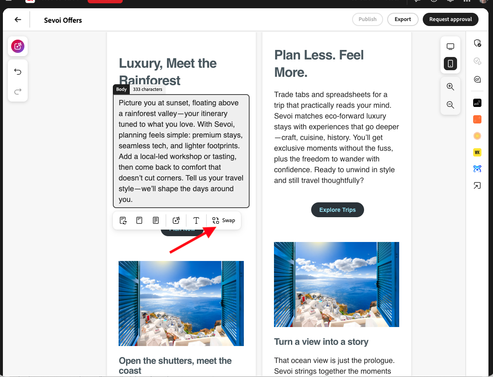
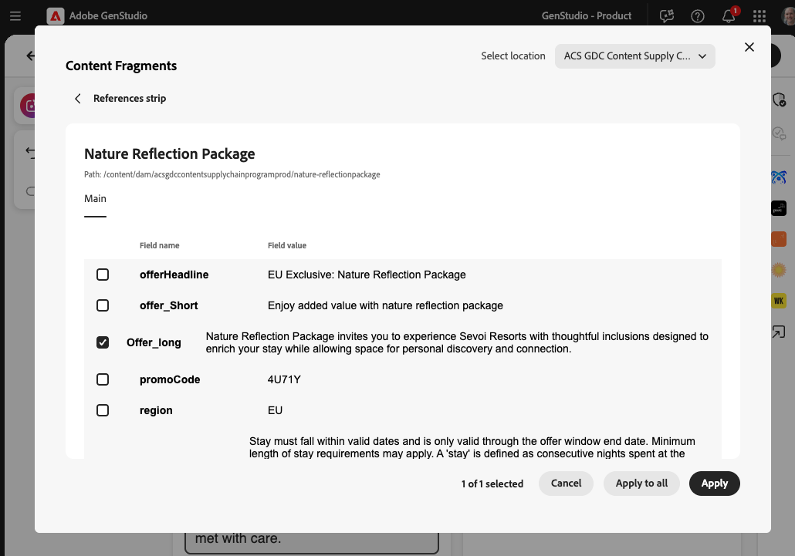

# Expériences e-mail

Avec Adobe GenStudio for Performance Marketing, vous pouvez utiliser l’IA générative pour rationaliser la [création d’expériences d’e-mail à fort impact](/help/user-guide/create/create-email-experience.md).

[!DNL Create] permet aux spécialistes du marketing modernes d’utiliser des [directives](/help/user-guide/guidelines/overview.md), des ressources d’image et une [&#x200B; invite bien conçue](/help/user-guide/effective-prompts.md) pour [&#x200B; rapidement des expériences d’e-mail alignées sur la marque](/help/user-guide/create/create-email-experience.md).

Lors de la génération d’expériences d’e-mail, quatre variations sont créées et affichées dans la zone de travail.

Les sections modifiables d’une expérience d’e-mail incluent :

* Pré-en-tête
* Titre
* Sous-titre
* Corps
* Call to action (CTA)
* Image

Voir [Éléments de modèle](/help/user-guide/templates/use-templates.md#template-elements).

<!-- 
## Email capabilities

Content creators and marketers can produce brand-consistent email experiences in GenStudio for Performance Marketing. 
-->

## Emails à plusieurs sections

Les expériences d’e-mail peuvent comporter plusieurs sections, ce qui permet une personnalisation complète pour s’aligner sur votre marque et vos objectifs. [Sélectionnez [!DNL Products] et les ressources visuelles pour chaque section](/help/user-guide/create/create-email-experience.md#add-parameters) et utilisez [des invites structurées](/help/user-guide/effective-prompts.md#structured-prompts) pour créer du contenu unique. Chaque section prend en charge une ressource visuelle.

Voir [Personnalisation de modèles avec des sections](/help/user-guide/templates/customize-template.md#sections-or-groups) pour savoir comment créer un modèle à plusieurs sections.

## Charge progressive

Lorsque le processus de génération de contenu démarre, chaque section de contenu généré dans les variantes d’e-mail se charge progressivement dans la zone de travail. Les expériences, les ressources, les champs et les sections des expériences apparaissent individuellement dans la zone de travail au fur et à mesure de leur génération.

Lorsque vous cliquez sur **[!UICONTROL Générer]**, un indicateur de chargement s’affiche au bas de la zone de travail pour vous mettre à jour sur la progression de la génération.

Chaque champ et section des expériences d’e-mail est progressivement chargé dans cette séquence :

1. Noms de variantes
1. Lignes d’objet pour toutes les variations
1. Pré-en-têtes
1. Titres, corps de l’e-mail (pour les e-mails à section unique) et appels à l’action
1. Corps de l’e-mail pour les sections suivantes (pour les e-mails à plusieurs sections)
1. Validation de la marque

   Le processus de validation de la marque et de vérification du contenu se produit et le résumé [_vérification du contenu_ &#x200B;](/help/user-guide/guidelines/brand-validation.md#content-check-summary) est renseigné pour chaque variante.

## Nombre de caractères

Après avoir généré un ensemble de variantes d’e-mail, vous pouvez voir le nombre de caractères affiché pour chaque section. Pointez ou cliquez sur une section générée, telle que l’objet ou le corps, et consultez le nom de la section et le nombre de caractères correspondants.

{width="500" zoomable="yes"}

## Permutation de fragment de contenu {#content-fragment-swap}

>[!NOTE]
>
>La permutation de fragment de contenu est disponible aujourd’hui pour les expériences **e-mail** sur la zone de travail. La prise en charge du canal **Horizon** sera bientôt disponible.

Le contenu des e-mails d’entreprise nécessite souvent à la fois une copie nouvellement générée et des blocs modulaires approuvés (tels que des clauses de non-responsabilité, un langage de sécurité, des offres et des revendications réglementées) ainsi que du contenu que vous façonnez pour les modèles. Les équipes qui stockent du contenu modulaire dans [!DNL Adobe Experience Manager], [!DNL Marketo Engage], [!DNL Adobe Journey Optimizer] et [!DNL Adobe Campaign] peuvent rechercher et échanger ce contenu pour l’utiliser dans les expériences d’e-mail sans quitter [!DNL GenStudio for Performance Marketing]. Cela peut s’avérer utile pour :

* **Contenu compatible avec la conformité :** IA peut remplir des emplacements créatifs tandis que des fragments approuvés par les spécialistes de la conformité remplacent des emplacements injectables ; les zones légales verrouillées restent inchangées grâce à l’exportation.
* **Composants de contenu approuvés réutilisables :** les titres approuvés, les clauses de non-responsabilité régionales ou les descriptions de produits peuvent rester le système d’enregistrement dans les [!DNL Adobe Experience Manager] pendant que les auteurs les extraient dans des variantes sans contournement par copier-coller.

Les créateurs assemblent les expériences sur la zone de travail ; les équipes de marque et de conformité conservent les workflows d’approbation en [!DNL Adobe Experience Manager] ; les équipes informatiques et d’intégration connectent les référentiels et les autorisations dont votre entreprise a besoin.

{width="500" zoomable="yes"}

Lorsque votre entreprise active la permutation de fragments de contenu, vous pouvez vous attendre à :

* Les champs de fragment de contenu peuvent être renseignés à partir d’une bibliothèque de contenu connectée au lieu d’une saisie manuelle ou d’une génération d’IA seule.
* Parcourez, recherchez et filtrez des fragments à l’aide de métadonnées telles que la campagne, le persona, le canal, la langue et la marque.
* Un sélecteur de référentiel est disponible lorsque plusieurs référentiels sont configurés.
* Aperçu d’un fragment avant qu’il ne remplace le texte du champ.
* Propagation d’une sélection de fragment à travers toutes les variantes en une seule action.

{width="500" zoomable="yes"}

Votre entreprise choisit les sources de fragments de contenu et les référentiels disponibles. Voir [Rechercher l’extension de fragment de contenu](/help/extensibility/deploy-app.md#find-content-fragment-extension) pour savoir comment les administrateurs configurent les sources et comment les auteurs permutent la copie de la zone de travail avec **[!UICONTROL permuter]**.
