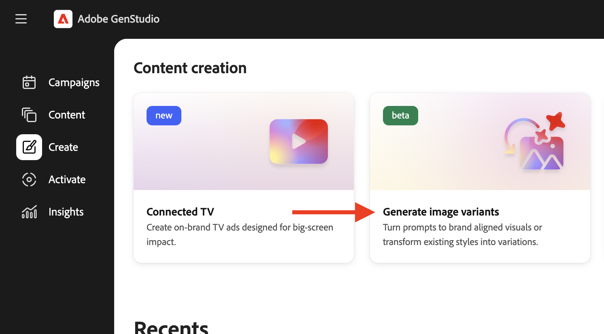
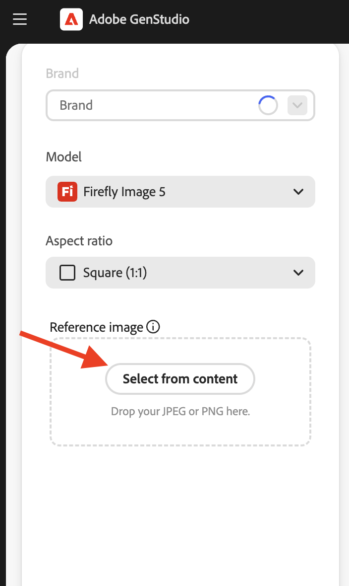

# Générer des variantes d’image

Avec GenStudio for Performance Marketing [[!DNL Create]](/help/user-guide/create/overview.md) (icône de pinceau), vous pouvez générer des ressources générées par _[!DNL Image variants]_&#x200B;qui s’inspirent d’une image choisie, en capturant son impact visuel et son esthétique globale.<!-- [two types of images](#image-types) using GenStudio for Performance Marketing [[!DNL Create]](/help/user-guide/create/overview.md) (paintbrush icon)—_[!DNL Image variants]_ and _[!DNL Similar images]_. -->

Pour concevoir une image attrayante et efficace, il est recommandé d’[ajouter des instructions à GenStudio for Performance Marketing](/help/user-guide/guidelines/add-guidelines.md) et de consulter les [principes de base de la création d’invites](/help/user-guide/effective-prompts.md).

## Types d’images

Les _[!DNL Image variants]_&#x200B;sont des ressources générées qui s’inspirent d’une image choisie, en capturant son impact visuel et son esthétique globale. Ces images sont créées à l’aide d’images déjà disponibles dans [!DNL Content] et d’une invite soigneusement conçue qui guide la conception. Ils suivent strictement les directives de la marque et les paramètres choisis au cours du processus de génération.

_[!DNL Image variants]_<!-- and _[!DNL Similar images]_ --> intégrer des directives, des paramètres et une [invite soigneusement conçue](/help/user-guide/effective-prompts.md) pour offrir des ressources d’images attrayantes.

<!-- * _[!DNL Similar images]_—Image assets created with strong similarity to an existing selected image available in [!DNL Content]. When generating similar images, GenStudio for Performance Marketing redesigns the selected image, giving slight variations on the content to provide variety and nuance. -->

## Générer des variantes d’image

Vous pouvez générer des [!DNL Image variants] à l’aide de directives, de paramètres et d’une image de référence sélectionnée. Ces éléments, ainsi que votre invite, guident la génération de [!DNL Image variants] cohérents.

### Choisir une image de référence

Pour créer des _[!DNL Image variants]_, sélectionnez une image existante enregistrée dans [!DNL Content]. Pour plus d’informations sur les dimensions d’image prises en charge[&#128279;](/help/user-guide/templates/best-practices-for-templates.md#follow-channel-specific-template-guidelines) consultez la section  Bonnes pratiques pour les modèles .

**Pour choisir une image de référence** :

1. Dans _[!DNL Create]_, cliquez sur **[!UICONTROL Générer des variantes d’image]**.
   {width="400" zoomable="yes"}
1. Pour choisir une image de référence, utilisez le bouton _[!UICONTROL Sélectionner à partir du contenu]_ pour rechercher une image spécifique.
   {width="200" zoomable="yes"}

   Pour utiliser des ressources à partir d’un référentiel de [!DNL AEM Assets Content Hub] connecté, choisissez un référentiel dans le menu déroulant _Emplacement_. Filtrez et sélectionnez une image.

   {width="400" zoomable="yes"}

1. Dans la vue _Sélectionner une image_, cliquez sur une image pour cocher la case de sélection.

   La taille de l’image sélectionnée peut atteindre 10 Mo. Une seule image peut être sélectionnée à la fois.

1. Cliquez sur **[!UICONTROL Utiliser]**.

   La zone de travail, qui sert de hub central pour la création de contenu, s’affiche.

### Ajouter des paramètres

L’intégration de [directives](/help/user-guide/guidelines/overview.md) et de paramètres améliore le processus de génération de contenu et constitue une étape préparatoire cruciale pour la production de [!DNL Image variants].

**Pour ajouter des instructions et des paramètres** :

1. Dans l’onglet _De base_, sélectionnez un [!DNL Brand] pour informer la création de contenu.

   Si aucune marque n’est disponible dans ce menu, [ajoutez des instructions à votre GenStudio for Performance Marketing](/help/user-guide/guidelines/add-guidelines.md).
1. Sélectionnez un modèle à utiliser pour la génération d’images dans _[!UICONTROL Modèle]_.
1. Sélectionnez le format souhaité dans _[!UICONTROL Format]_.

### Saisir une invite

Après avoir sélectionné les paramètres, créez une invite en utilisant le langage naturel pour commencer à générer des variantes d’image.

Voir [Rédiger des invites efficaces](/help/user-guide/effective-prompts.md).

**Pour saisir une invite** :

1. Entrez une invite dans la zone d&#39;invite.
1. Cliquez sur **[!UICONTROL Générer]**.

Par défaut, quatre variations, alimentées par l’invite, les paramètres et le contenu que vous avez ajouté, sont générées et affichées dans la zone de travail.

### Modifier dans Adobe Express

Après avoir généré des variantes d’image, vous pouvez les modifier directement dans Adobe GenStudio for Performance Marketing à l’aide d’Adobe Express.

**Pour modifier une image individuelle à l’aide d’Adobe Express** :

1. Passez la souris sur une variante d’image générée et cliquez sur _[!UICONTROL Modifier dans Adobe Express]_.

   Une fenêtre _Optimisée par Adobe Express_ s’affiche.

1. Effectuez la modification de l’image, comme [recadrage d’une image](https://helpx.adobe.com/express/create-and-edit-images/edit-images/crop-images.html), [suppression d’un objet](https://helpx.adobe.com/express/create-and-edit-images/create-and-modify-with-generative-ai/remove-objects-generative-fill.html) et application d’effets.

   Consultez la [documentation &#x200B;](https://helpx.adobe.com/express/user-guide.html) pour savoir comment réviser des images dans GenStudio for Performance Marketing avec Adobe Express.

1. Cliquez sur _[!UICONTROL Appliquer les modifications]_ pour enregistrer vos modifications.
1. Continuez à modifier individuellement les variantes d’image selon vos besoins et à appliquer les modifications pour enregistrer votre progression.

### Vérifier l’alignement de la vérification du contenu

Pour optimiser les variantes générées et garantir une stricte conformité à l’identité de la marque, aux directives de la plateforme et aux normes d’accessibilité, tirez parti de la puissance du panneau [_Vérification de contenu_](/help/user-guide/guidelines/brand-validation.md#content-check-panel). Ce panneau affiche des détails complets de vérification du contenu et illumine les zones d’amélioration.

**Pour effectuer des vérifications de contenu** :

1. Cliquez sur l’icône du panneau _Vérification de contenu_ dans la barre d’actions de droite pour ouvrir le panneau [_Vérification de contenu_](/help/user-guide/guidelines/brand-validation.md#content-check-panel). Affichez un résumé des contrôles *Révision requise* et *Réussite* pour identifier les sections et directives à améliorer.

   {width="500" zoomable="yes"}

1. Révisez les variantes d’image pour vous assurer que vos variantes sont étroitement alignées avec les contrôles de contenu effectués.

Voir [&#x200B; Validation de la marque &#x200B;](/help/user-guide/guidelines/brand-validation.md).

<!-- 
## Generate Similar images

You can quickly generate images similar to a selected image within [!DNL Content] from the [!DNL Create] home.

**To create _[!DNL Similar images]_**:

1. In _[!DNL Create]_, click **[!UICONTROL Similar images]**.
1. Use the search option, adjacent to _Filter_, to find a specific image.

   To use assets from a connected [!DNL AEM Assets Content Hub] repository, choose a repository from the _Location_ drop-down menu. Filter and select one image.

1. In the _Select image_ view, click on an image.
1. Click **[!UICONTROL Use]**.

   The Canvas, which serves as the central hub for content creation, is displayed. Four image variations similar to the original selected image appear.

   {width="400" zoomable="yes"} 
-->

## Publication et exportation d’images

Les brouillons d’image générés sont affichés dans la section _Récents_ de la page d’accueil [!DNL Create].

Pour rendre les images générées disponibles pour une utilisation actuelle et future, publiez-les dans [!UICONTROL Contenu] et exportez-les pour les utiliser dans vos campagnes marketing.

1. **Pour publier vos nouvelles images**, cliquez sur **[!UICONTROL Publier]** dans la barre d’outils supérieure.
   1. _[!UICONTROL Ajoutez des détails]_ tels que _[!UICONTROL Campagnes]_ ou _[!UICONTROL Canaux]_, le cas échéant.
   1. Cliquez sur **[!UICONTROL Publier]**.

1. **Pour exporter vos nouvelles images**, cliquez sur **[!UICONTROL Exporter]** dans la barre d’outils supérieure.
   1. Sélectionnez le format (JPG ou PNG), puis cliquez sur **[!UICONTROL Exporter]**.

Consultez [[!DNL Content]](/help/user-guide/content/overview.md#search-and-find-approved-content).
