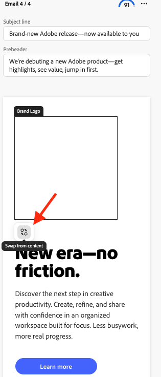

# Utiliser la permutation de logo dans [!DNL Create]

Utilisez la permutation de logo pour remplacer les logos de marque dans les modèles lors de la création de contenu dans [!DNL GenStudio for Performance Marketing].

## Conditions préalables

- Configurez les modèles à l’aide du [Guide de configuration de la permutation de logo](logo-swap-setup.md). L’icône Permutation de logo s’affiche uniquement pour les modèles qui incluent les espaces réservés de logo requis.
- Pour que les logos soient interchangeables pendant le workflow de **[!DNL Create]**, ils doivent être stockés dans **[!DNL Brands]**.

## Changer un logo lors de la création de contenu

1. Dans **[!DNL Create]**, sélectionnez un canal sur la page de destination.
1. Choisissez un modèle qui comprend un logo interchangeable. L’aperçu du modèle affiche une zone d’espace réservé grise où apparaît le logo.
   {width="300"}
1. Créez du contenu comme d’habitude. Quatre variantes apparaissent.
1. Pointez sur la zone du logo pour afficher l’espace réservé.
   {width="200"}
1. Cliquez sur la zone Logo de la marque, puis sur **[!UICONTROL Permuter à partir du contenu]**.
   {width="200"}
1. Dans le panneau Logo de la marque , sélectionnez un logo, puis cliquez sur **[!UICONTROL Utiliser]** pour l’appliquer à la variante actuelle ou **[!UICONTROL Appliquer à toutes les variantes]** pour l’appliquer aux quatre variantes.
1. Vous pouvez également utiliser des logos de recherche par nom de marque ou par filtre pour trouver un logo.
   {width="300"}
1. Vous pouvez également utiliser une recherche par filtre pour trouver un logo.
   {width="300"}
1. Maintenant que le logo a été permuté, poursuivez le processus de création de contenu (fermez le brouillon, exportez ou demandez une approbation).

Les logos peuvent être échangés à tout moment.

>[!NOTE]
>Si l’icône d’échange de logo ne s’affiche pas, vérifiez que le modèle est configuré pour l’échange de logo et que les logos sont disponibles dans [!DNL Brands].
