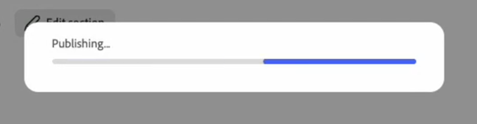
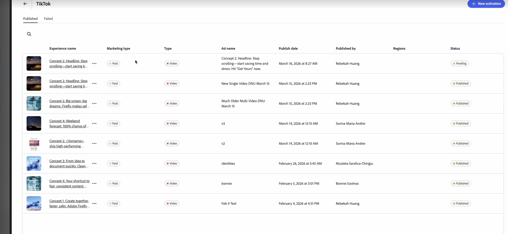

# Expériences TikTok

Avec [!DNL GenStudio for Performance Marketing], vous pouvez créer des annonces TikTok sous la forme d’expériences de médias achetés dans le workflow de [[!DNL Create]](/help/user-guide/create/overview.md). Générez des variantes créatives, exécutez des vérifications de marque et de canal, publiez sur [!DNL Content] et activez-les via [[!DNL Activate]](/help/user-guide/activation/overview.md), afin de diffuser du contenu au gestionnaire TikTok Ads pour révision finale et lancement.

TikTok dans [!DNL GenStudio for Performance Marketing] s’intègre dans un workflow omnicanal plus large : vous pouvez analyser les performances des campagnes et des annonces TikTok dans les vues [!DNL Insights] standard ([!UICONTROL Campagnes], [!UICONTROL Annonces], [!UICONTROL Médias] et [!UICONTROL Attributs]) dans [[!DNL Insights]](/help/user-guide/insights/overview.md#dashboard) avec d’autres canaux sociaux et d’affichage (tels que Meta et LinkedIn), au lieu de passer à des outils de création de rapports distincts. La présentation cross-canal **[!UICONTROL Insights 2.0]** ([Présentation d’Insights - Insights 2.0](/help/user-guide/insights/overview.md#insights-20)) se concentre uniquement sur Meta et LinkedIn ; TikTok n’y est pas inclus pour le moment.

[!DNL Insights] des mesures de surfaces, notamment :

* Impressions
* Clics
* Taux de clic publicitaire (CTR)
* Coût par clic (CPC)
* Coût par acquisition (CPA)
* Coût par mille (CPM)
* Dépenses

Affichez vos résultats, comparez l’efficacité créative et affinez le ciblage et les budgets en un seul endroit. Les mises à jour quotidiennes des données vous permettent d’optimiser plus rapidement sans quitter [!DNL GenStudio for Performance Marketing].

## Conditions préalables

Avant de créer ou d’activer des publicités TikTok, procédez comme suit :

### Accès et rôle

Assurez-vous de disposer d’un rôle **Éditeur** ou supérieur dans GenStudio for Performance Marketing. Voir [Rôles utilisateur et autorisations](/help/user-guide/user-roles.md).

### Connecter votre compte TikTok Ads

1. Accédez à **[!UICONTROL Paramètres]** > **[!UICONTROL TikTok]** > **[!UICONTROL Gérer]** > **[!UICONTROL Ajouter un compte]**.
1. Dans la pop-up, connectez-vous au gestionnaire TikTok Ads.
1. Vérifiez que vous disposez d’un accès **Opérateur** ou **Administrateur** au compte publicitaire.
1. Ajoutez TikTok en tant que canal et connectez-vous OAuth au gestionnaire TikTok Ads.

### Activer la configuration

Un gestionnaire système a connecté votre compte TikTok Ads dans [!DNL Activate] :

* Au moins un compte publicitaire TikTok est activé pour l’utilisation.

### Créer une configuration

* Votre [&#x200B; marque, vos produits et vos rôles](/help/user-guide/guidelines/overview.md) sont configurés de sorte que l’application puisse générer une copie et des mises en page sur la marque.
* Au moins un modèle TikTok est chargé. Adobe recommande un modèle vidéo vertical TikTok, optimisé pour un emplacement dans le flux, avec un rapport d’aspect **9:16** et des zones sécurisées pour l’interface utilisateur supérieure et inférieure.
* Les vidéos sont chargées vers [!DNL Content].

## Générer une publicité TikTok dans le flux

### Démarrer une expérience TikTok

{width="90%"}
**Pour démarrer une expérience TikTok** :

1. Accédez à **[!UICONTROL Créer]** et choisissez **[!UICONTROL TikTok]**.
1. Sélectionnez un modèle TikTok et cliquez sur **[!UICONTROL Utiliser]**.
1. Dans la zone de travail, sélectionnez **[!UICONTROL Marque]**, **[!UICONTROL Produit]**, **[!UICONTROL Persona]** et **[!UICONTROL Langue]**.
1. Sélectionnez une vidéo dans [!DNL Content].
1. Saisissez une invite pour votre copie de titre TikTok.
1. Cliquez sur **[!UICONTROL Générer]**.
   {width="40%"}

GenStudio for Performance Marketing génère quatre variantes de contenu créatif.

Vous pouvez :

* Utilisez **[!UICONTROL Régénérer]** ou **[!UICONTROL Affiner]** pour ajuster la tonalité, la longueur ou l’accentuation.
* Modifiez le texte directement dans la zone de travail.
* Utilisez **[!UICONTROL Swap]** pour sélectionner une vidéo alternative à partir de [!DNL Content].
* Utilisez **[!UICONTROL Recadrer]** ou **[!UICONTROL Redimensionner]** pour ajuster la disposition vidéo dans l’image **9:16**.

### Exécuter des vérifications de marque et de canal

Avant d’enregistrer ou d’envoyer l’expérience pour révision, exécutez des vérifications de contenu :

1. Cliquez sur **[!UICONTROL Vérification du contenu]** (vérifications de marque et de canal).
1. Consultez les résultats de la validation pour :
   * **Directives relatives à la marque** : ton, termes restreints, utilisation du logo.
   * **Règles de canal TikTok**—format, type de fichier, longueur de copie.
1. Résolvez les problèmes signalés (par exemple, la longueur de la copie ou le texte dense à l’écran).

Voir [Validation de la marque](/help/user-guide/guidelines/brand-validation.md) pour en savoir plus sur les vérifications de contenu.

## Enregistrement d’une publicité TikTok dans GenStudio for Performance Marketing

Déplacez votre expérience TikTok dans la bibliothèque [!DNL Content] afin qu’elle puisse être révisée, réutilisée et activée.
Il existe deux états :

* **Projet d&#39;expérience** — Un travail en cours et non approuvé.
* **Expérience publiée** — Contenu approuvé et disponible en [!DNL Content] pour activation.

### Envoyer pour révision

**Pour envoyer pour révision** :

1. Dans l’en-tête **[!DNL Experience]**, cliquez sur **[!UICONTROL Demander la révision]**.
1. Sélectionnez les approbateurs (par exemple, marque, service juridique ou performances).
   * (Facultatif) Ajoutez une note dans **[!UICONTROL Paramètres]**.
1. Cliquez sur **[!UICONTROL Envoyer pour révision]**.

Les approbateurs peuvent afficher la prévisualisation vidéo, la description et les résultats de call to action (CTA) ainsi que les résultats de vérification des marques et des canaux. Il peut approuver l’expérience ou demander des modifications.

### Publier sur [!DNL Content]

Après toutes les approbations requises :

1. Cliquez sur **[!UICONTROL Publier dans le contenu]**.
1. Confirmer les métadonnées :
   * Nom de la campagne ou de l’activation
   * Région, langue, persona, étape funnel
   * Canal : TikTok
1. Cliquez sur **[!UICONTROL Publier]**.

L’annonce TikTok apparaît désormais dans [!DNL Content]. Elle est détectable à l’aide de filtres tels que [!DNL Channel] ou [!DNL Campaign] et prête à être sélectionnée en [!DNL Activate].

## Activer une publicité TikTok

L’activation de TikTok utilise le même module [!DNL Activate] que Meta et Campaign Manager 360 (CM360). Vous pouvez démarrer à partir du workflow de [!DNL Content] ou du workflow de [!DNL Activate].

**Pour démarrer une activation TikTok** :

1. Ouvrez la mosaïque Canal TikTok .
1. Cliquez sur **[!UICONTROL Créer une activation]**.
1. Sélectionnez une ou plusieurs expériences TikTok publiées dans [!DNL Content].

Chaque expérience correspond généralement à une publicité TikTok, avec une ou plusieurs variantes vidéo.

### Configurer la configuration de l’expérience

Pour chaque expérience sélectionnée, confirmez :

* Texte du Principal
* Call to action
* URL de destination

### Configurer la configuration de la plateforme

Fournissez les détails du gestionnaire TikTok Ads tels que :

* Compte TikTok Ads
* Campaign
* Groupe publicitaire
* Nom de l’annonce (un par annonce TikTok)

### Révision et publication

1. Passez en revue tous les détails de contenu créatif et de plateforme.
1. Cliquez sur **[!UICONTROL Publier]**.

GenStudio for Performance Marketing envoie les publicités au gestionnaire de publicités de TikTok en mode pause ou en mode brouillon.

### Que se passe-t-il ensuite ?

Une fenêtre modale _Publication en cours_ s’affiche et se ferme automatiquement. Vous êtes redirigé vers la table Activation de TikTok .

{width="30%"}

Le tableau des activations affiche les dernières activations, avec un statut **En attente** pendant que le traitement est terminé.Vous pouvez quitter cette page pendant la publication terminée.

{width="90%"}

Une fois l’opération terminée, un pop-up de confirmation affiche un message de réussite ou d’échec. Si vous cliquez sur ce pop-up ou sur l’activation de TikTok dans le tableau d’activation, vous accédez à la page **Détails**. La page **Détails** contient des informations d’activation complètes et un lien profond vers l’annonce publiée dans TikTok Ads Manager.

Si l’activation échoue, un statut **Échec** s’affiche avec un message d’erreur de TikTok.

Dans TikTok Ads Manager, les équipes multimédia peuvent :

* Effectuez les vérifications finales.
* Activation des publicités ou des groupes de publicités.

Comme pour les autres canaux, GenStudio for Performance Marketing diffuse les contenus publicitaires dans un état inactif, de sorte que les propriétaires de canaux contrôlent le calendrier et le budget de lancement final.
