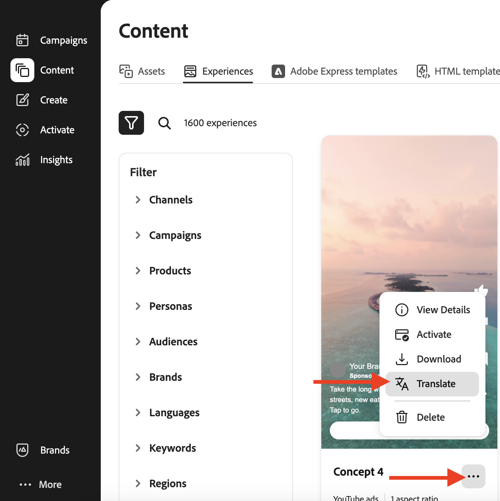
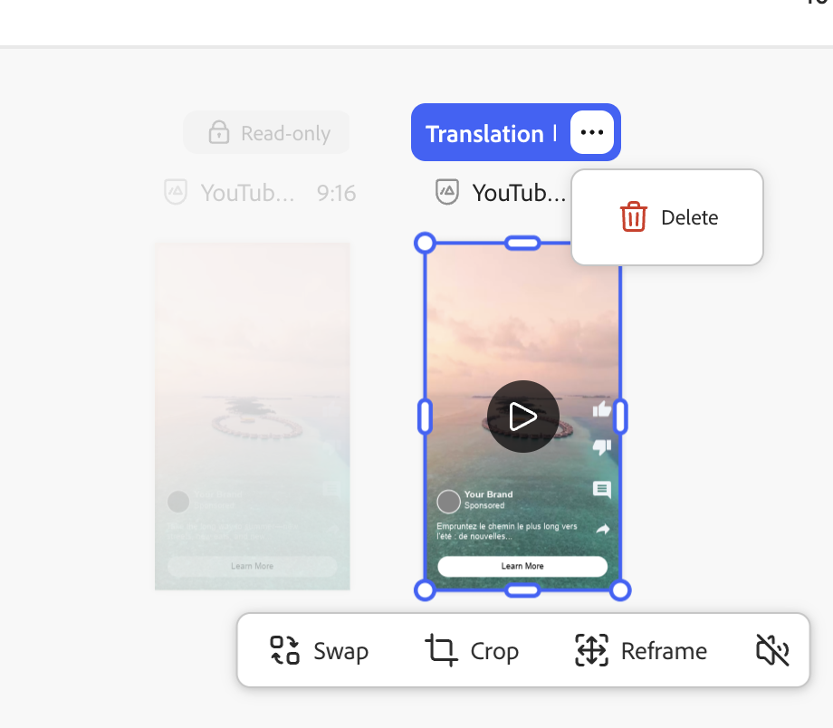

# Traduction et localisation d’expériences

Adobe [!DNL GenStudio for Performance Marketing] offre des services de traduction prêts à l’emploi sur la zone de travail HTML afin que les marketeurs internationaux et régionaux puissent adapter les expériences approuvées dans plusieurs langues sans outils de traduction externes.

Cette fonctionnalité utilise Azure Open AI par défaut. Votre entreprise peut également se connecter à un service de traduction préféré via des [extensions de traduction](/help/extensibility/deploy-app.md#find-translation-extensions).

La traduction commence à partir d’une expérience approuvée enregistrée dans [!DNL Content]. L’expérience source peut être dans n’importe quelle langue. Chaque variante traduite s’ouvre sur la zone de travail [!DNL Create] en tant que brouillon modifiable que vous pouvez exporter, envoyer pour révision et publier en tant qu’expérience distincte.

## Expériences prises en charge

La traduction prête à l’emploi sur la zone de travail HTML prend en charge les éléments suivants :

* [Expériences email](/help/user-guide/create/email-experiences.md)
* Expériences multimédias payantes, y compris les annonces , [LinkedIn](/help/user-guide/create/linkedin-experiences.md) et [Display](/help/user-guide/create/display-ad-experiences.md)

## Avant de commencer

Vérifiez que l’expérience que vous souhaitez traduire est **approuvée** et disponible dans la galerie [!DNL Content] _[!UICONTROL Expériences]_. Les expériences en version préliminaire ou en révision ne sont pas des sources de traduction éligibles.

Si votre entreprise enregistre une extension de traduction personnalisée, GenStudio for Performance Marketing utilise ce service au lieu de la traduction par défaut d’Azure Open AI. Voir [Recherche d’extensions de traduction](/help/extensibility/deploy-app.md#find-translation-extensions).

## Traduire à partir de [!DNL Create] {#translate-from-create}

Démarrez une traduction à partir de la page de destination [!DNL Create] pour localiser une expérience approuvée.

{width="600" zoomable="yes"}

**Pour traduire depuis[!DNL Create]** :

1. Dans [!DNL Create], faites défiler l’écran jusqu’à la section _Création de contenu_.
1. Cliquez sur **[!UICONTROL Traduire et localiser la copie]**.
1. Sélectionnez l’expérience de média payant ou d’e-mail approuvée que vous souhaitez traduire. Cliquez sur le bouton **[!UICONTROL Utiliser]**.
1. Sélectionnez les langues cibles dans la liste des langues prises en charge. Cliquez sur **[!UICONTROL Traduire]**.

Les variantes traduites s’affichent dans la zone de travail.

## Traduire à partir de [!DNL Content] {#translate-from-content}

Vous pouvez également commencer la traduction à partir de [!DNL Content] lorsque vous parcourez des expériences approuvées.

### Depuis la galerie Expériences

{width="500" zoomable="yes"}

**Pour traduire depuis la galerie Expériences** :

1. Dans [!DNL Content], ouvrez l’onglet **[!UICONTROL Expériences]**.
1. Recherchez l’expérience approuvée à traduire.
1. Cliquez sur le menu d’options (points de suspension) de la carte d’expérience.
1. Cliquez sur **[!UICONTROL Traduire]**.
1. Sélectionnez les langues cibles dans la liste des langues prises en charge. Cliquez sur **[!UICONTROL Traduire]**.

## Utiliser les traductions sur la zone de travail

Dans la zone de travail HTML, l’expérience source ne peut pas être modifiée, car elle est déjà approuvée. Les expériences sources d’e-mails semblent verrouillées. Vous pouvez modifier le texte des variantes traduites directement sur la zone de travail. Voir [Gérer les variantes](/help/user-guide/create/manage-variants.md) pour obtenir des conseils sur la modification de la copie de variante.

Les expériences traduites n’exécutent pas de validation de marque et n’affichent pas de score de marque. L’expérience source a déjà été créée avec des directives de marque, révisée et approuvée.

La régénération de fragment n’est pas prise en charge pour les expériences traduites.

### Supprimer une langue traduite

**Pour supprimer une langue traduite de la zone de travail** :

1. Dans la zone de travail [!DNL Create], cliquez sur le menu d’options (points de suspension) dans l’en-tête de variante traduite.
1. Cliquez sur **[!UICONTROL Supprimer]**.

{width="500" zoomable="yes"}

La langue traduite est supprimée de la zone de travail.

### Actualiser une traduction de média payante

Après avoir modifié la copie de média payant traduite, vous pouvez recharger la sortie de traduction originale.

**Pour actualiser une traduction de média payante** :

1. Dans la zone de travail [!DNL Create], ouvrez le menu d’options dans la variante traduite modifiée.
1. Cliquez sur **[!UICONTROL Actualiser la traduction]**.

>[!NOTE]
>
>Une actualisation de la traduction est disponible pour les expériences média payantes. La traduction d’e-mail ne prend pas en charge l’actualisation de la traduction pour le moment.

## Exporter, réviser et publier

Une fois les traductions chargées sur la zone de travail, vous pouvez les exporter, les envoyer pour approbation et publier les variantes approuvées dans [!DNL Content].

**Pour exporter les expériences traduites** :

1. Sur la zone de travail [!DNL Create], cliquez sur **[!UICONTROL Exporter]** dans la barre d’outils.
1. Sélectionnez un format d’exportation.
   * E-mail : **CSV et images** ou **HTML uniquement**
   * Médias payants : **CSV + JPG**, **CSV + PNG** ou **HTML + images**
1. Cliquez sur **[!UICONTROL Exporter]**.

Vous pouvez également [exporter des expériences depuis [!DNL Content]](/help/user-guide/content/manage-assets.md#export-experiences).

**Pour demander une révision et une approbation** :

1. Sur la zone de travail [!DNL Create], cliquez sur **[!UICONTROL Demander l’approbation]**.
1. Attribuez au moins un approbateur et envoyez la demande.

Voir [Demander la révision et l’approbation](/help/user-guide/approvals/request-review.md) pour plus d’informations sur le workflow de révision.

**Pour publier des traductions approuvées** :

1. Une fois que les approbateurs ont approuvé les variantes traduites, cliquez sur **[!UICONTROL Publier]**.
1. Dans la fenêtre de publication, confirmez les métadonnées telles que le nom de la campagne, les périodes, les régions et les mots-clés.

Voir [Publication du contenu approuvé](/help/user-guide/approvals/publish-content.md).

Chaque traduction publiée est enregistrée dans [!DNL Content] en tant qu’expérience distincte.

## Métadonnées d’expérience traduites

Les traductions publiées incluent des métadonnées qui relient chaque variante à sa source, notamment :

* **Titre** — suit le modèle `Translation from "<source title>" <channel>`, par exemple `Translation from "Summer campaign" Meta`
* **Créé par** — l&#39;utilisateur qui a initié la traduction
* **Date de création** — Date de la traduction
* **Source traduite** — Lien vers l’expérience source dans [!DNL Content]
* **Traduit de** — la langue source

## Limites

Gardez à l’esprit les contraintes suivantes lorsque vous traduisez des expériences sur la zone de travail HTML :

* L’expérience source doit déjà être approuvée et enregistrée dans [!DNL Content].
* La validation de la marque ne s’exécute pas sur les variantes traduites.
* La régénération de fragment n’est pas prise en charge sur les expériences traduites.
* L’actualisation de la traduction est disponible pour les médias achetés uniquement.

## Informations connexes

* [Expériences email](/help/user-guide/create/email-experiences.md)
* [Expériences Meta](/help/user-guide/create/meta-experiences.md)
* [Afficher les expériences publicitaires](/help/user-guide/create/display-ad-experiences.md)
* [Gestion des ressources et des expériences](/help/user-guide/content/manage-assets.md)
* [Rechercher des extensions de traduction](/help/extensibility/deploy-app.md#find-translation-extensions)
