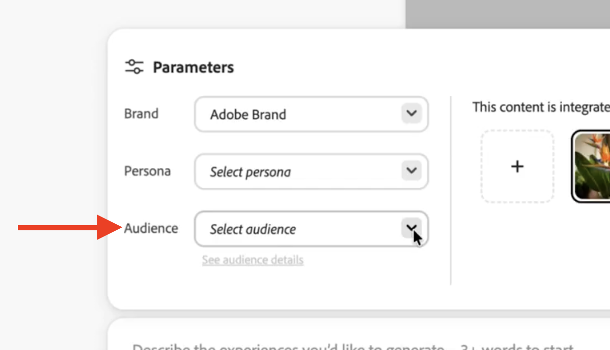
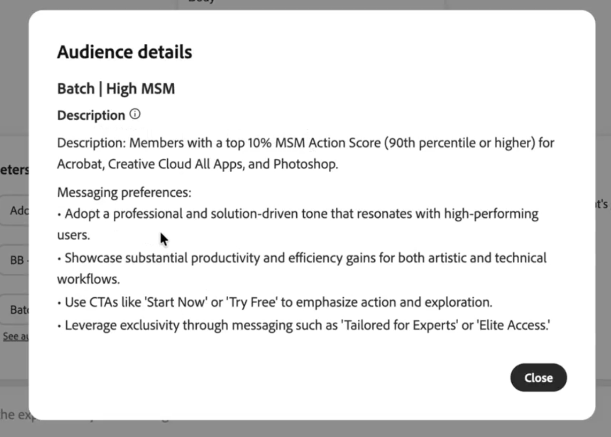

# Ajout d’instructions

GenStudio for Performance Marketing vous permet de définir des directives définies par l’utilisateur pour vous assurer que tout contenu généré par l’IA est personnalisé pour s’aligner sur l’identité d’une marque. Cette page fournit des instructions pour définir et utiliser chaque consigne disponible spécifique. Pour une explication générale, voir la [présentation des instructions](/help/user-guide/guidelines/overview.md).

L’ajout d’instructions à GenStudio for Performance Marketing est une étape importante du processus de création. Les directives guident le processus de création de contenu, ainsi que les invites définies par l’utilisateur, les [contrôles d’accessibilité et de contenu](overview.md#compliance) et la technologie d’IA générative d’Adobe, afin de créer des ressources efficaces.

Les instructions peuvent être définies par l’utilisateur ou exister en tant qu’instructions par défaut, telles que les instructions [default [!DNL Brand] channel](/help/user-guide/guidelines/brands.md#default-channel-guidelines).

Lors de la création de variantes à partir d’un modèle avec des instructions de canal prédéfinies (telles que [!DNL Brands], [!DNL Personas] ou [!DNL Products]), ces instructions s’appliquent aux variantes. Vous pouvez les modifier si vous le souhaitez.

{{in-academy}}

## Conseils pour l’ajout depuis une URL

Lorsque vous choisissez d’ajouter une [!DNL Brand], une [!DNL Product] ou une [!DNL Persona] à partir d’une URL dans [!DNL GenStudio for Performance Marketing], tenez compte des informations ci-dessous.

**Conditions préalables pour les workflows basés sur des URL** :

- Vous disposez d’un **compte [!DNL GenStudio for Performance Marketing] actif** avec Brand Manager ou des autorisations supérieures.
- L’**URL est accessible au public**. Les pages protégées par mot de passe ou par nom d’utilisateur génèrent un résultat limité.
- **Pour obtenir de meilleurs résultats, utilisez l’URL du site web de la marque** (une page d’accueil ou une page de produit/catégorie) au lieu d’un retailer, d’un revendeur ou d’un agrégateur.

**Types d’URL et sorties attendues** :

| Type d’URL | À quoi s’attendre ? |
| --- | --- |
| Page d’accueil de la marque | Vous obtenez des directives complètes sur la marque et le système affiche une large couverture produit et personnelle. |
| Page de catégorie de produits | Les produits et les rôles sont inclus dans la catégorie représentée sur cette page. |
| Page de destination de Campaign | Les signaux personnels sont particulièrement utiles, mais la sortie de la marque peut refléter la campagne au lieu de la marque complète. |
| Retailer ou page de partenaire | Le système donne la priorité au contenu tiers, de sorte que la sortie sera limitée. |
| Page bloquée/avec connexion obligatoire | Le contenu de la page n’étant pas disponible, la sortie sera conservatrice. |

## Ajouter des marques

Pour ajouter une [!DNL Brand], [téléchargez un guide de marque](#upload-a-brand), [créez manuellement une marque](#manually-add-brand) ou [créez une marque à partir d’une URL](#creating-a-brand-from-url). Lorsque vous chargez des fichiers ou ajoutez une marque manuellement, sélectionnez des directives et saisissez les détails de votre marque. [Publiez un  [!DNL Brand]](#publish-brand) pour le [!DNL Content] afin de le rendre disponible pour une utilisation lors de la génération future de contenu.

Dans la zone de navigation de gauche, cliquez sur **[!DNL Brands]** dans la liste _Partagé_.

{width="650" zoomable="yes"}

Si vous téléchargez des directives de marque écrites dans une langue autre que l’anglais (ou si vous créez manuellement une marque à l’aide d’une langue autre que l’anglais), GenStudio for Performance Marketing les affiche dans la même langue.

>[!TIP]
>
>Chaque marque fonctionne indépendamment sans aucune relation hiérarchique. Pour créer des sous-marques sous une marque parent, incluez les informations de la marque parent pendant le processus de création.

### Charger une marque

Vous pouvez charger vos propres documents de directives de marque (jusqu’à trois fichiers PDF ou DOC) dans GenStudio for Performance Marketing pour créer automatiquement une marque.

Consultez [[!DNL Brands]](/help/user-guide/guidelines/brands.md).

**Pour charger des documents de marque** :

1. Dans le panneau _[!DNL Brands]_, sélectionnez le bouton **[!UICONTROL Ajouter une marque]**.
1. Sélectionnez **[!UICONTROL Charger des PDF]** et saisissez un nom de marque dans la fenêtre contextuelle _Choisir un moyen d’ajouter votre marque_.
1. Sélectionnez **[!UICONTROL Continuer]**.
1. Recherchez et joignez ou faites glisser vos documents de directives de marque sur la fenêtre contextuelle _[!UICONTROL Ajouter votre marque]_.

   Vous pouvez joindre jusqu’à cinq fichiers PDF pour un maximum de 500 Mo.

1. Sélectionnez **[!UICONTROL Ajouter une marque]**.

   À l’aide de la technologie d’IA générative d’Adobe, GenStudio for Performance Marketing extrait des informations de vos documents chargés et commence à créer votre marque. Les informations sur la marque, telles que les directives relatives à la voix, au canal et à l’image de la marque, sont renseignées à mesure que chaque directive de vos documents de marque est assemblée.

La vue de votre nouvelle marque s’ouvre, affichant les détails des directives de marque extraits de vos documents. Une fenêtre contextuelle vous informe _« Votre marque est prête à passer en revue »_ et vous rappelle de passer en revue le contenu extrait et d’apporter les modifications nécessaires.

### Ajouter manuellement une marque

Vous pouvez ajouter manuellement des détails sur la marque, au lieu de charger des documents de marque existants, pour renseigner une nouvelle [marque](brands.md).

**Pour ajouter manuellement une marque**

1. Sélectionnez le bouton **[!UICONTROL Ajouter une marque]**.
1. Sélectionnez **[!UICONTROL Charger manuellement]** et saisissez un nom de marque dans la fenêtre contextuelle _Choisir un moyen d’ajouter votre marque_.
1. Sélectionnez **[!UICONTROL Ajouter une marque]**.

   Une nouvelle marque vierge est créée et affichée.

1. Renseignez diverses informations sur la marque, des directives et des images pour créer votre marque dans les sections appropriées (onglets dans la partie supérieure).

   Vous pouvez ajouter des directives directement depuis la page d’accueil de votre nouvelle marque _ou_ vous pouvez les ajouter dans les sections à onglets individuelles (qui incluent des informations _Afficher des exemples_ des info-bulles pour vous guider) dans la partie supérieure.

   {width="600" zoomable="yes"}

   - _Quand utiliser cette marque_ : cliquez sur **[!UICONTROL Ajouter]** (ou cliquez dans le champ de texte pour modifier le texte existant) et saisissez un aperçu et des informations sur l’utilisation de la marque. Cliquez sur **[!UICONTROL Enregistrer les modifications]**.
   - [_[!DNL Brand] des instructions vocales _](brands.md#brand-voice-guidelines): ajoutez les informations applicables dans chaque champ d’instructions.

     ![Ajout de directives vocales [!DNL Brand] ](/help/assets/brand-voice-add.png){width="500" zoomable="yes"}

   - [_Instructions relatives aux images_](brands.md#image-guidelines) : cliquez sur **[!UICONTROL Ajouter une catégorie]** pour ajouter des catégories d’instructions telles que « Instructions générales relatives aux objets d’art » ou « Photographie de produit ». Renseignez les directives dans chaque catégorie ajoutée.
   - [_Instructions relatives aux canaux_](brands.md#channel-guidelines) : cliquez sur chaque canal disponible et ajoutez les instructions appropriées.
   - [_Logos_](brands.md#logos) : cliquez sur **[!UICONTROL Ajouter un logo]** pour effectuer un glisser-déposer ou recherchez et chargez un logo.
   - [_Couleurs_](brands.md#colors) : cliquez sur **[!UICONTROL Ajouter une couleur]** pour utiliser un code de couleur hexadécimal ou RGB, ou sur le sélecteur de couleurs pour ajouter des couleurs individuelles.

     {width="600" zoomable="yes"}

Pour afficher les [!DNL Brands] que vous avez créées, cliquez sur la flèche vers l’arrière située en haut du panneau _[!UICONTROL Marques]_ pour revenir à l’accueil _[!UICONTROL Marques]_.

Il n’est pas nécessaire de [publier](#publish-brand) votre [!DNL Brand] pour rendre les informations accessibles. Toute information ajoutée manuellement est disponible immédiatement après son ajout. Pour que d’autres membres de votre organisation puissent utiliser les informations de [!DNL Brand] dans GenStudio for Performance Marketing, vous devez les publier. Un [!DNL Brand] créé est en version préliminaire jusqu’à sa publication.

### Création d’une marque à partir d’une URL

**Conditions préalables :** la section [Conditions préalables pour les workflows basés sur des URL](#prerequisites-for-url-based-workflows). Pour connaître l’impact des différentes URL sur les résultats, voir [Types d’URL et sortie attendue](#url-types-and-expected-output).

**Pour créer une marque à partir d’une URL :**

1. Accédez à **[!DNL Brands]** dans GenStudio, puis cliquez sur le bouton **[!UICONTROL +Ajouter une marque]**.
1. Lorsque vous êtes invité à _Choisir un moyen d’ajouter votre marque_, sélectionnez **[!UICONTROL via l’URL]**.
1. Saisissez l&#39;URL de la marque dans le champ fourni.
1. Le système lit la page et génère automatiquement des directives de marque. Ce processus prend généralement moins d’une minute.
1. Consultez la carte des directives de marque générée et modifiez les champs selon vos besoins.
1. Cliquez sur **[!UICONTROL Enregistrer]**. La marque est désormais disponible pour la génération de contenu.

### Modifier la miniature de la marque

Après avoir ajouté manuellement une [!DNL Brand], vous pouvez modifier l’image miniature pour vous assurer qu’elle est facilement reconnaissable dans votre liste de [!DNL Brands].

Si un [!DNL Brand] est créé avec l’extraction de document (au lieu d’être ajouté manuellement), un logo disponible dans ces documents est automatiquement implémenté comme image miniature.

**Modification manuelle de l’image miniature d’une[!DNL Brand]** :

1. Sélectionnez **[!UICONTROL Modifier la miniature]** dans le menu d’actions.
1. Chargez une nouvelle image dans l’onglet _Charger_.
1. Dans _[!UICONTROL Modifier la miniature]_, modifiez l’image chargée.
1. Sélectionnez **[!UICONTROL Mettre à jour]** pour enregistrer l’image en tant qu’image miniature [!DNL Brand].

Vous pouvez sélectionner un logo [!DNL Brand] existant pour une [!DNL Brand] dans la vue d’onglet [!UICONTROL Logos]. Cliquez pour ouvrir un logo et sélectionnez **[!UICONTROL Utiliser comme miniature de marque]** dans le menu d’actions.

### Publier la marque

Avant de publier un [!DNL Brand] brouillon, cliquez sur toutes les sections d’instructions pour passer en revue toutes les informations renseignées. Apportez les modifications nécessaires aux directives de la marque.

Dans _[!DNL Brands]_, les [!DNL Brands] de brouillon ou publiées s’affichent sous forme de mosaïques. Un badge d’état_ Publié&#x200B;_ou_ Brouillon _et la dernière fois que la marque a été modifiée s’affiche au bas de chaque mosaïque.

>[!TIP]
>
>Si vous souhaitez afficher uniquement les marques que vous avez créées, sélectionnez **[!UICONTROL Créé par vous]** dans le filtre [!DNL Brands] (icône funnel).

**Pour publier un brouillon de marque** :

1. Dans la zone de navigation de gauche, cliquez sur **[!UICONTROL [!DNL Brands]]**.
1. Cliquez sur une vignette pour ouvrir un brouillon de [!DNL Brand] existant.
1. Cliquez sur le bouton **[!UICONTROL Publier]** (disponible uniquement pour les brouillons).
1. Dans la fenêtre contextuelle _Publier la marque_, vérifiez qui a accès à l’affichage et à l’utilisation des [!DNL Brand] publiées.
1. Dans la fenêtre contextuelle _Publier_ qui s’affiche, sélectionnez **[!UICONTROL Publier]**.

   La fenêtre contextuelle confirme que le [!DNL brand] est publié—« {Brand} est maintenant prêt ».

1. Cliquez sur **[!UICONTROL Terminé]** pour quitter la fenêtre contextuelle.

Le [!DNL brand] affiche un point vert et le bouton « Publié » en regard du nom, et un bouton **[!UICONTROL Modifier le[!DNL brand]]** s’affiche à la place du bouton **[!UICONTROL Publier]**.

**Pour dépublier une[!DNL brand]** publiée, cliquez sur la marque pour l’ouvrir et cliquez sur **[!UICONTROL Dépublier]** dans le menu d’actions (icône représentant des points de suspension).

La marque publiée peut désormais être utilisée dans [_[!DNL Create]_](/help/user-guide/create/overview.md) et [_[!DNL Content]_](/help/user-guide/content/overview.md).

### Gestion des marques

Dans l’accueil _[!DNL Brands]_, vous pouvez cliquer pour ouvrir une marque déjà créée afin de la gérer ou de la publier.

Pour **afficher les informations sur la marque**, cliquez sur **[!UICONTROL [!DNL Brands]]** dans la zone de navigation de gauche, puis sur pour ouvrir une marque existante.

**Pour modifier une marque** dans la vue [!DNL Brands] :

1. Dans **[!DNL Brands]**, cliquez pour ouvrir une marque définie.
1. Pour afficher des détails individuels ou modifier des instructions, cliquez sur [**[!UICONTROL Instructions relatives à la voix de la marque]**](brands.md#brand-voice-guidelines), [**[!UICONTROL Instructions relatives aux images]**](brands.md#image-guidelines), [**[!UICONTROL Instructions relatives aux canaux]**](brands.md#channel-guidelines), [**[!UICONTROL Logos]**](brands.md#logos) ou [**[!DNL Colors]**](brands.md#colors) dans la partie supérieure.
1. Pour gérer un logo de marque, cliquez sur [**[!UICONTROL Logos]**](brands.md#logos) en haut et cliquez sur le menu d’action (points de suspension).
   1. Sélectionnez **[!UICONTROL Afficher les détails]** pour afficher des informations relatives aux [!DNL Brand] telles que _Format_ et _Taille_.
   1. Sélectionnez **[!UICONTROL Télécharger]** pour télécharger le logo.
   1. Sélectionnez [**[!UICONTROL Utiliser comme miniature de marque]](#change-brand-thumbnail) pour définir le logo comme image miniature.
   1. Sélectionnez **[!UICONTROL Renommer]** pour renommer le logo.
   1. Sélectionnez **[!UICONTROL Supprimer]** pour supprimer le logo.
1. Pour renommer une marque existante, cliquez dans le titre et saisissez un nouveau titre.
1. Pour dupliquer une marque existante, sélectionnez **[!UICONTROL Dupliquer]** dans le menu d’actions _[!DNL Brands]_.
   1. Saisissez un nom de marque dans la fenêtre contextuelle _Dupliquer la marque_ et cliquez sur **[!UICONTROL Dupliquer la marque]**.

      La fenêtre contextuelle confirme la duplication de la marque : « Nouvelle marque créée ». La marque dupliquée est initialement en mode _Dépublié_.

   1. Personnalisez la marque dupliquée, puis [publiez-la](#publish-brand) pour la rendre disponible à l’utilisation.
1. Pour supprimer une marque, sélectionnez **[!UICONTROL Supprimer]** dans le menu d’actions [!DNL Brands].

## Ajouter [!DNL Personas]

Pour ajouter une personne, [téléchargez-la](#upload-a-persona), [créez-la manuellement](#manually-add-persona) ou [ajoutez-la à partir d’une URL](#adding-personas-from-url). Lorsque vous téléchargez des fichiers ou ajoutez un persona manuellement, sélectionnez des directives et saisissez les détails de votre persona.

Dans la zone de navigation de gauche, cliquez sur **[!DNL Personas]** dans la liste _Partagé_.

{width="650" zoomable="yes"}

Vous pouvez ajouter un [!DNL Persona] dans GenStudio for Performance Marketing pour cibler le contenu que vous créez sur l’audience idéale.

Consultez [[!DNL Personas]](personas.md).

### Charger une persona

Vous pouvez charger vos propres documents personnels pour remplir de nouveaux rôles.

Consultez [[!DNL Personas]](/help/user-guide/guidelines/personas.md).

1. Dans le panneau _[!DNL Personas]_, sélectionnez le bouton **[!UICONTROL Ajouter un persona]**.
1. Sélectionnez **[!UICONTROL Télécharger des fichiers]** et saisissez un nom de persona dans la fenêtre contextuelle _Choisir un moyen d’ajouter votre persona_.
1. Sélectionnez **[!UICONTROL Continuer]**.
1. Recherchez et joignez ou faites glisser vos documents de directives personnelles dans la fenêtre contextuelle _[!UICONTROL Ajouter votre persona]_.

   Vous pouvez joindre jusqu’à cinq fichiers PDF ou DOC pour un maximum de 500 Mo.

1. Sélectionnez **[!UICONTROL Ajouter des rôles]**.

   À l’aide de la technologie d’IA générative d’Adobe, GenStudio for Performance Marketing extrait les informations de vos documents chargés et commence à créer votre persona. À mesure que chaque consigne de vos documents personnels est assemblée, des détails tels que les consignes relatives à la voix, au canal et aux images de la personne sont renseignés.

   La vue de votre nouveau persona s’ouvre, affichant les détails des directives personnelles extraits de vos documents. Une fenêtre contextuelle vous informe _« Votre persona est prêt à réviser »_ et vous rappelle de réviser le contenu extrait et d’apporter les modifications nécessaires.

### Ajouter manuellement des personas

Vous pouvez ajouter manuellement des détails personnels, au lieu de charger des documents personnels existants, pour renseigner un nouveau [persona](personas.md).

**Pour ajouter manuellement un persona** :

1. Sélectionnez le bouton **[!UICONTROL Ajouter une personne]** et choisissez **[!UICONTROL Ajouter manuellement]**.
1. Cliquez sur **[!UICONTROL Continuer]**.

   Vous pouvez remplir différentes instructions et images facultatives pour créer votre persona.

1. Cliquez sur **[!UICONTROL Nouveau nom du persona]** et saisissez un nom pour le [!DNL Persona].
1. Ajoutez des informations sur votre [!DNL Persona] dans la section _Description_.

   ![Ajouter un [!DNL Persona]](/help/assets/personas-add.png){width="650" zoomable="yes"}

1. Cliquez dans _Description_ et saisissez une description de ce [!DNL Persona].
1. Cliquez dans _Préférences de messagerie_ et saisissez les détails de messagerie du [!DNL Persona].
1. Pour modifier la miniature, pointez sur la miniature de l’image et, dans le menu d’actions, sélectionnez **[!UICONTROL Modifier la miniature]**.
   1. Choisissez une image dans la galerie sous l’onglet _Galerie_ _ou_ téléchargez une nouvelle image sous l’onglet _Télécharger_.

      Vous pouvez également supprimer ou recadrer une image miniature existante dans l’onglet _Télécharger_.

   1. Cliquez sur **[!UICONTROL Utiliser l’image]**.
1. Pour modifier l’image de la couverture, pointez sur la couverture et, dans le menu d’actions, sélectionnez **[!UICONTROL Modifier la couverture]**.
   1. Choisissez une image dans la galerie sous l’onglet _Galerie_ _ou_ téléchargez une nouvelle image sous l’onglet _Télécharger_.
   1. Cliquez sur **[!UICONTROL Utiliser l’image]**.
   1. Pour repositionner l’image de couverture, cliquez sur **[!UICONTROL Repositionner]** dans le menu d’actions, faites glisser l’image à la position souhaitée, puis cliquez sur **[!UICONTROL Enregistrer]**.

   Pour afficher les [!DNL Personas] que vous avez créées, cliquez sur la flèche vers l’arrière située en haut de la vue _Persona_ pour revenir à la page d’accueil _[!DNL Personas]_.

### Ajout de [!DNL Personas] depuis l’URL

**Conditions préalables :** la section [Conditions préalables pour les workflows basés sur des URL](#prerequisites-for-url-based-workflows). Pour connaître l’impact des différentes URL sur les résultats, voir [Types d’URL et sortie attendue](#url-types-and-expected-output).

**Pour ajouter des rôles à partir d’une URL :**

1. Accédez à **[!DNL Personas]** dans GenStudio, puis cliquez sur le bouton **[!UICONTROL +Ajouter une personne]**.
1. Lorsque vous êtes invité à _Choisir un moyen d’ajouter votre persona_, sélectionnez **[!UICONTROL via l’URL]**.
1. Saisissez l&#39;URL de la marque dans le champ fourni.
1. Consultez la liste des segments d’audience affichés à partir de la page. Supprimez les segments qui ne s’appliquent pas, renommez-les si nécessaire et ajoutez ceux qui manquent.
1. Confirmez la liste. Le système commence à générer des cartes personnelles complètes pour chaque segment confirmé.
1. Les cartes personnelles apparaissent dans la bibliothèque au fur et à mesure qu’elles se terminent. Examinez et modifiez chaque persona avant de l’utiliser pour la génération de contenu.

### Gérer les [!DNL Personas]

Dans _[!DNL Personas]_page d’accueil, vous pouvez **ouvrir un[!DNL Persona]**déjà créé pour le modifier ou le réviser, ou **supprimer un persona**de la liste :

- Sélectionnez **[!UICONTROL Ouvrir]** dans le menu d’actions [!DNL Personas] pour réviser et passer en revue un persona existant.
- Sélectionnez **[!UICONTROL Supprimer]** dans le menu d’actions [!DNL Personas] pour **Supprimer** une personne.
- Sélectionnez **[!UICONTROL Renommer]** dans le menu d’actions [!DNL Personas] pour **Renommer** une personne.

## Ajouter [!DNL Products]

Pour ajouter un produit :

1. Dans la zone de navigation de gauche, cliquez sur **[!DNL Products]** dans la liste _Partagé_.
   {width="650" zoomable="yes"}
1. Dans le panneau _[!DNL Products]_, sélectionnez **[!UICONTROL Ajouter un produit]**.
1. Choisissez de [charger un produit](#upload-a-product), [créer manuellement un produit](#manually-add-a-product) ou [ajouter des produits à partir d’une URL](#adding-products-from-url). Lorsque vous téléchargez des fichiers ou ajoutez un produit manuellement, sélectionnez Recommandations et saisissez les détails du produit.

![Ajouter un [!DNL Product]](/help/assets/products-add.png){width="650" zoomable="yes"}

Vous pouvez inclure un [!DNL Product] dans GenStudio for Performance Marketing afin de mieux adapter le contenu que vous créez à un produit spécifique.

Consultez [[!DNL Products]](products.md).

### Chargement d’un produit

Vous pouvez charger vos propres documents de produit pour renseigner de nouveaux produits.

Consultez [[!DNL Products]](/help/user-guide/guidelines/products.md).

1. Sélectionnez le bouton **[!UICONTROL Ajouter un produit]**.
1. Sélectionnez **[!UICONTROL Télécharger des fichiers]** et saisissez un nom de produit dans la fenêtre contextuelle _Choisir un moyen d’ajouter votre produit_.
1. Sélectionnez **[!UICONTROL Continuer]**.
1. Recherchez et joignez ou faites glisser vos documents de directives de produit dans la fenêtre contextuelle _[!UICONTROL Ajouter votre produit]_.

   Vous pouvez joindre jusqu’à cinq fichiers PDF ou DOC pour un maximum de 500 Mo.

1. Sélectionnez **[!UICONTROL Ajouter des produits]**.

   À l’aide de la technologie d’IA générative d’Adobe, GenStudio for Performance Marketing analyse vos documents chargés pour créer votre profil de produit. Au fur et à mesure que chaque consigne de vos documents produit est traitée, des informations telles que les descriptions des produits, les propositions de valeur et les préférences de messagerie sont renseignées.

   La vue de votre nouveau produit s’ouvre et affiche les détails des directives produit extraits de vos documents. Une fenêtre contextuelle vous informe _« Votre produit est prêt à être révisé »_ et vous rappelle de réviser le contenu extrait et d’apporter les modifications nécessaires.

### Ajout manuel d’un produit

Vous pouvez ajouter manuellement des détails de produit, au lieu de charger des documents de produit existants, pour renseigner un nouveau [produits](products.md).

**Pour ajouter manuellement un produit** :

1. Sélectionnez le bouton **[!UICONTROL Ajouter un produit]** et choisissez **[!UICONTROL Ajouter manuellement]**.
1. Cliquez sur **[!UICONTROL Continuer]**.

   Vous pouvez renseigner diverses informations facultatives pour créer votre produit.

1. Cliquez sur **[!UICONTROL Nouveau nom du produit]** et saisissez un nom pour le [!DNL product].
1. Ajoutez des informations sur votre [!DNL product] dans la section _Description_.
1. Cliquez dans _Description_ et saisissez une description de ce [!DNL Product].
1. Cliquez dans _Proposition de valeur_ et saisissez les détails de la proposition de valeur pour positionner correctement votre [!DNL Product].
1. Cliquez dans _Préférences de messagerie_ et saisissez les détails de messagerie du [!DNL product].
1. Pour modifier la miniature, pointez sur la miniature de l’image et, dans le menu d’actions, sélectionnez **[!UICONTROL Modifier la miniature]**.
   1. Choisissez une image dans la galerie sous l’onglet _Galerie_ _ou_ téléchargez une nouvelle image sous l’onglet _Télécharger_.

      Vous pouvez également supprimer ou recadrer une image miniature existante dans l’onglet _Télécharger_.

   1. Cliquez sur **[!UICONTROL Utiliser l’image]**.
   1. Pour modifier l’image de la couverture, pointez sur la couverture et, dans le menu d’actions, sélectionnez **[!UICONTROL Modifier la couverture]**.
   1. Choisissez une image dans la galerie sous l’onglet _Galerie_ _ou_ téléchargez une nouvelle image sous l’onglet _Télécharger_.
   1. Cliquez sur **[!UICONTROL Utiliser l’image]**.
   1. Pour repositionner l’image de couverture, cliquez sur **[!UICONTROL Repositionner]** dans le menu d’actions, faites glisser l’image à la position souhaitée, puis cliquez sur **[!UICONTROL Enregistrer]**.

   Pour afficher les [!DNL Products] que vous avez créées, cliquez sur la flèche vers l’arrière située en haut de la vue _Produit_ et revenez à la page d’accueil _[!DNL Products]_.

### Ajout de produits à partir d’une URL

**Conditions préalables :** la section [Conditions préalables pour les workflows basés sur des URL](#prerequisites-for-url-based-workflows). Pour connaître l’impact des différentes URL sur les résultats, voir [Types d’URL et sortie attendue](#url-types-and-expected-output).

**Pour ajouter des [!DNL Products] à partir d’une URL :**

1. Accédez à **[!DNL Products]** dans GenStudio, puis cliquez sur le bouton **[!UICONTROL +Ajouter un produit]**.
1. Lorsque vous êtes invité à _Choisir un moyen d’ajouter votre produit_, sélectionnez **[!UICONTROL via l’URL]**.
1. Saisissez une URL. Utilisez la page d’accueil de la marque pour obtenir une large liste de produits ou une page de catégorie pour définir la portée des résultats.
1. Examinez la liste des produits affichés à partir de la page. Supprimez les éléments qui n’appartiennent pas, renommez-les si nécessaire et ajoutez les produits qui n’appartiennent pas.
1. Confirmez la liste. Le système commence à générer des détails complets sur chaque produit confirmé.
1. Les produits apparaissent dans la bibliothèque. Examinez et modifiez chaque produit avant de l’utiliser pour la génération de contenu.

### Gérer les [!DNL Products]

Dans _[!DNL Products]_page d’accueil, vous pouvez **ouvrir un[!DNL Product]**déjà créé pour le modifier ou le réviser, ou **supprimer un produit**de la liste :

- Sélectionnez **[!UICONTROL Ouvrir]** dans le menu d’actions [!DNL Products] pour réviser et réviser un produit existant.
- Sélectionnez **[!UICONTROL Supprimer]** dans le menu d’actions [!DNL Products] pour **Supprimer** un produit.
- Sélectionnez **[!UICONTROL Renommer]** dans le menu d’actions [!DNL Products] pour **Renommer** un produit.

## Ajouter [!DNL Audiences]

>[!NOTE]
>
>La fonctionnalité [!DNL Audiences] nécessite une intégration par l’équipe Adobe pour apparaître dans GenStudio. Si _[!DNL Audiences]_n’apparaît pas dans les paramètres du modèle, contactez votre représentant Adobe.

[!DNL Audiences] fournir des segments de clients ciblés à partir d’Adobe Real-Time Customer Data Platform (RTCDP), en apportant des données de ciblage précises dans votre workflow de génération de contenu. GenStudio for Performance Marketing exploite les définitions d’audience pour vous aider à créer du contenu marketing personnalisé aligné sur des segments de clientèle spécifiques.

[!DNL Audiences] s’affichent sous forme de liste déroulante dans le volet des paramètres, dans [le workflow _[!DNL Create]_](../create/overview.md#templates)._[!DNL Audiences]_ peut ajouter de la spécificité aux _[!DNL Personas]_lorsque les deux directives sont utilisées, mais peut également être utilisé efficacement de manière indépendante.

Lors de l’intégration, les définitions d’audience sont importées et transformées dans un format compatible avec GenStudio. Ce processus prend généralement quelques jours. Contactez votre équipe Adobe pour le lancer.

**Conditions préalables** :

- Accès de l’organisation à Adobe Real-Time Customer Data Platform
- Audiences existantes déjà configurées dans les sandbox RTCDP
- L’intégration _[!DNL Audience]_nécessite un processus d’intégration manuel par l’équipe d’Adobe

**Pour sélectionner une audience** :

1. Dans [le workflow de _[!DNL Create]_](../create/overview.md#templates), sélectionnez un modèle, puis cliquez sur le bouton **[!UICONTROL Utiliser]**pour ouvrir le brouillon.
1. Dans la liste des paramètres, cliquez sur le menu déroulant _[!UICONTROL Audience]_ pour afficher toutes les audiences disponibles.
   {width=450}
1. Sélectionnez une audience à affecter dans la liste. Le système suggère des audiences recommandées qui s’alignent sur les [!DNL Persona] sélectionnées, si un [!DNL Persona] est sélectionné.
1. Cliquez sur **[!UICONTROL Voir les détails de l’audience]** pour afficher la description développée et les préférences de messagerie générées pour l’audience sélectionnée. Les détails de l’audience informent la génération du contenu, en veillant à ce que votre contenu créatif s’aligne sur les caractéristiques et préférences spécifiques de votre segment cible.
   {width=450}
