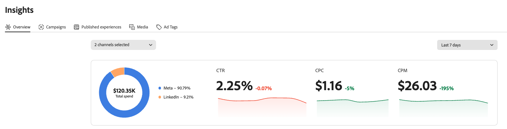
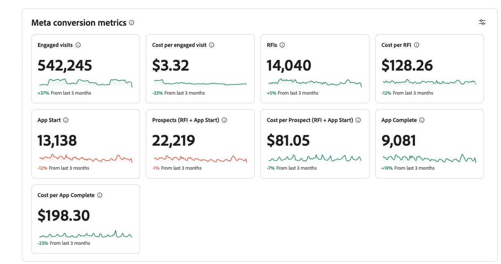
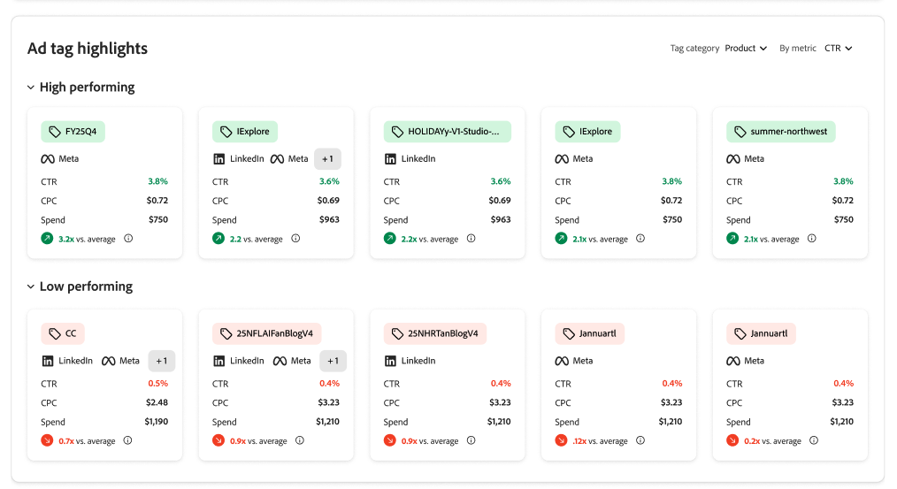

# Adobe GenStudio for Performance Marketing Insights

Adobe GenStudio for Performance Marketing [!DNL Insights] fournit des analyses avancées et des informations sur les performances du contenu qui peuvent vous aider à prendre des décisions fondées sur des données.

Dans le tableau de bord [!DNL Insights], vous pouvez effectuer les actions suivantes :

- **Identifier le contenu le plus efficace** : déterminez quel contenu fonctionne le mieux auprès des différentes audiences et adaptez le contenu ou les campagnes futures en fonction des tendances.
- **Optimiser le contenu peu performant** : recherchez le contenu non attractif et utilisez l’IA générative intégrée pour créer immédiatement des variations, améliorant potentiellement son efficacité sans devoir repartir de zéro.
- **Dynamiser le contenu performant** : reprenez le contenu qui a fait ses preuves et modifiez-le pour actualiser la publicité pour l’audience ou adaptez le contenu principal pour l’utiliser dans de nouvelles campagnes, ce qui peut prolonger son cycle de vie et améliorer ses performances.

Le module [!DNL Insights] comprend **[!UICONTROL Insights 2.0]**, une expérience de performance cross-canal pour les réseaux sociaux payants. Il fonctionne en parallèle avec les vues détaillées du tableau et de la galerie dans la section [Tableau de bord](#dashboard) de cet article.

## Insights 2.0 {#insights-20}

**[!UICONTROL Insights 2.0]** fournit une couche d’intelligence des performances qui donne aux personnes chargées du marketing une vue transparente des performances du marketing social payant sur plusieurs comptes connectés.

**Dans [!UICONTROL Insights 2.0], vous pouvez effectuer les actions suivantes :**

- **Consulter les présentations cross-canal ou mono-canal (Meta et LinkedIn)** : consultez un aperçu consolidé des deux canaux sociaux payants, ou analysez un seul canal.
- **Utiliser le rapport de performances cross-canal** : affichez la part des résultats de chaque canal avec une visualisation de contribution en pourcentage, y compris les dépenses totales (pourcentage et montant) et les mesures de part de performance telles que le CTR, le CPC et le CPM.
  
- **Utiliser le rapport de performance publicitaire** : identifier les publicités les plus performantes et celles qui le sont le moins, grâce à des classements et des mesures qui facilitent la prise de décisions en matière d’optimisation.
  
- **Analyser les mesures de conversion de Meta** : concentrez-vous sur les conversions en assurant une visibilité sur le coût par acquisition (CPA) à travers les différentes étapes du funnel (par exemple, les visites engagées, les demandes d’informations, le démarrage de l’application, le prospect et l’application terminée) et examinez l’évolution des tendances de conversion au fil du temps. Les données de conversion sont disponibles dans GenStudio for Performance Marketing.
  
- **Découvrez les informations issues des balises publicitaires** : les identifiants de suivi des publicités sont analysés et transformés en balises structurées, ce qui vous permet d’analyser les performances en fonction des dimensions que vous définissez (telles que le CTA, la zone géographique, le format ou le concept), de visualiser l’attribution du budget sur ces dimensions et de consacrer moins de temps au décodage manuel des conventions de nommage.
  

>[!NOTE]
>
>**[!UICONTROL Insights 2.0]** comprend actuellement UNIQUEMENT **Meta** et **LinkedIn**. TikTok, DV360 et Innovid ne figurent pas pour l’instant dans la vue d’ensemble d’**[!UICONTROL Insights 2.0]**. Les vues **[!UICONTROL Campagnes]**, **[!UICONTROL Publicités]**, **[!UICONTROL Média]** et **[!UICONTROL Attributs]** de la section [Tableau de bord](#dashboard) continuent de prendre en charge le jeu de canaux plus large décrit sous [Canaux pris en charge](#channels-supported).

## Connecteurs de données

La première fois que vous ouvrez [!DNL Insights], il se peut qu’une bannière s’affiche pour vous guider dans la connexion d’Adobe GenStudio for Performance Marketing à un compte de canal.

Cette connexion permet à GenStudio for Performance Marketing de recevoir des données statistiques de vos campagnes marketing, médias et publicités actifs. Initialement, GenStudio for Performance Marketing importe les données des 6 derniers mois afin que vous disposiez des outils nécessaires pour analyser les données les plus récentes et prendre les mesures appropriées.

{{connect-insights}}

## Canaux pris en charge {#channels-supported}

Les canaux pris en charge dans Insights comprennent Meta, LinkedIn, TikTok, DV360 et Innovid.

Meta, LinkedIn et TikTok offrent une visibilité complète sur les campagnes, les publicités, les médias et les attributs. DV360 et Innovid offrent actuellement une couverture de données plus limitée.

Actuellement, les données média ne sont pas disponibles pour DV360 et Innovid, ce qui signifie que l’onglet Attributs n’est pas non plus affiché pour ces canaux. L’onglet Attributs dépend des données au niveau des médias pour afficher les caractéristiques extraites des expériences.

Cette limitation est due aux contraintes propres aux plateformes de média acheté et ne pose pas de problème avec GenStudio for Performance Marketing.

## Tableau de bord {#dashboard}

Le tableau de bord [!DNL Insights] comporte un tableau configurable pour chaque type de contenu : [!UICONTROL Canaux], [!UICONTROL Publicités], [!UICONTROL Média] et [!UICONTROL Attributs].

Tableau de bord ![[!DNL Insights]](/help/assets/insights-dashboard.png)

Chaque vue affiche un tableau correspondant dans lequel vous pouvez effectuer une recherche par mot-clé, appliquer des filtres et définir une période. Vous pouvez cliquer sur l’icône des paramètres (icône représentant un engrenage) située au-dessus du côté droit du tableau pour activer ou désactiver l’affichage de certains types de colonnes. La ligne _[!UICONTROL Résumé]_ peut afficher les totaux ou les moyennes d’une colonne.

Les éléments [!UICONTROL Publicités], [!UICONTROL Média] et [!UICONTROL Attributs] incluent une vue de galerie qui vous permet de numériser et de trier des ressources à l’aide de cartes avec une image ou une miniature vidéo. Il existe une option permettant d’afficher l’une des trois mesures clés suivantes sur chaque vignette : `Click-through rate`, `Cost per click` et `Spend`.

### Campagnes

La vue [[!DNL Insights] _[!UICONTROL Campagnes ]_](campaigns.md) est la vue par défaut et affiche une liste des détails des campagnes actives, tels que les objectifs, le budget, la date de lancement et l’activité. Veillez à [connecter un compte de canal](/help/user-guide/connectors/connect-channel.md) afin que GenStudio for Performance Marketing commence à recevoir vos données statistiques.

### Expériences publiées

La vue [[!DNL Insights] _[!UICONTROL Détails des expériences publiées ]_](published-experiences.md) se concentre sur l’évaluation de l’efficacité d’une expérience. La vue [!UICONTROL Expériences publiées] vous permet d’analyser les mesures d’une expérience en fonction de son emplacement sur une période spécifiée. En cliquant sur un_[!UICONTROL  nom de l’expérience ]_, vous pouvez afficher les mesures de performance de l’expérience, les performances par placement et les attributs.

### Média

La vue Média [[!DNL Insights] __](media.md) est conçue pour vous aider à analyser les performances du contenu créatif. Vous pouvez identifier les attributs des médias qui contribuent à améliorer une mesure sélectionnée, tels que les clics ou les impressions.

En cliquant sur le contenu du média, vous obtenez des informations supplémentaires sur ses performances dans plusieurs publicités et placements publicitaires :

{width="600" zoomable="yes"}

Dans la vue Détails du média, la partie gauche affiche une miniature de la ressource et une liste d’attributs. Trois mesures clés sont mises en évidence : `Click-through rate`, `Cost per click` et `Spend`. Les indicateurs de performances montrent comment les valeurs réelles (ligne continue) se comparent à la valeur moyenne (ligne en pointillés) sur la période sélectionnée (la valeur par défaut est `Last 30 days`).

### Attributs

Les _attributs_ des médias permettent d’identifier le contenu créatif par des détails inhérents, tels que la couleur, le ton, la composition (comme l’objet, les polices, les éléments visuels) et d’autres composants clés. Les attributs constituent souvent l’ensemble d’informations de contenu le moins mesuré et analysé.

La vue Attributs [[!DNL Insights] __](attributes.md) peut vous aider à identifier les attributs les plus performants auprès de certains publics, canaux et régions, et peut vous aider à mettre en évidence les tendances saisonnières. Grâce à ces informations, vous pouvez utiliser des attributs performants pour créer des variantes, cibler une audience spécifique ou expérimenter différentes stratégies de campagne.

### Balises des publicités

La vue Balises des publicités [[!DNL Insights] __](ad-tags.md)affiche une liste de publicités pour le compte publicitaire du canal connecté. Une_ publicité&#x200B;_est une ressource promotionnelle qui comprend du contenu visuel et interactif destiné à être diffusé auprès d’une audience spécifique dans le cadre d’une campagne marketing.
