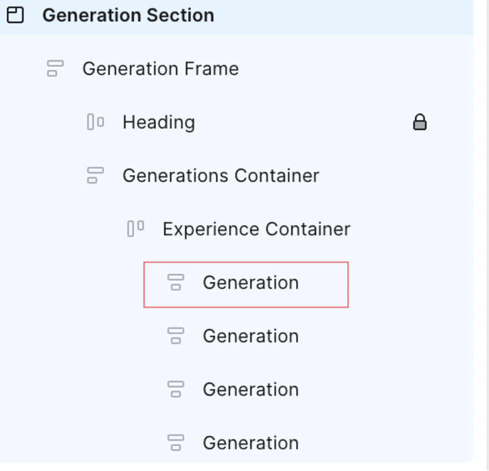

# Plug-in Figma pour GenStudio for Performance Marketing

Le plug-in GenStudio for Performance Marketing Figma ajoute un nouveau panneau à l’application Figma qui vous permet de générer du contenu sur la marque.

Cette page décrit comment configurer et utiliser le plug-in .

Les fonctionnalités de ce plug-in incluent :

* Mappez des éléments de texte Figma aux champs GenStudio for Performance Marketing, tels que `headline`, `body`, `on_image_text`, etc.
* Meta Générez de nouvelles [!DNL Experiences] d’annonces publicitaires sur la marque, sur LinkedIn ou sur Display en fonction d’une marque, d’un persona, d’un produit et d’une invite de texte.
* Créez des [!DNL Experiences] directement dans le document Figma en remplaçant le texte des éléments Figma mappés par des valeurs générées par GenStudio for Performance Marketing.
* Reformuler, raccourcir, allonger ou traduire le contenu existant en fonction d’une invite.
* Traduisez le [!DNL Experiences] généré dans plusieurs langues.
* Exportez les [!DNL Experiences] générés vers une source locale sous forme d’images aplaties.
* Exportez les [!DNL Experiences] générés vers GenStudio for Performance Marketing.
* Utilisez des options de module externe qui s’adaptent aux éléments sélectionnés dans la zone de travail Figma.

>[!VIDEO](https://video.tv.adobe.com/v/3478809?learn=on)

## Créer un modèle

Le plug-in nécessite les deux premiers niveaux de votre document Figma pour respecter cette convention :

* **Section** - Il s’agit du projet parent, qui peut contenir plusieurs modèles.
* **Frame** - Représente un modèle au sein d’un projet. Le modèle peut être rempli de texte, d’images, de composants et d’autres éléments.

### Modèles Meta

Ces tailles de modèle sont prises en charge :

Pour les publications sur Instagram ou Facebook :

* Largeur : 1080 px (fixe)
* Hauteur : 1 080 px ou 1 350 px

Pour les histoires sur Instagram ou Facebook :

* Largeur : 1080 px (fixe)
* Hauteur : 1920 px

Le plug-in décide du chrome de l’expérience générée en fonction de la hauteur du modèle.

### Afficher les modèles

Il n’existe aucune exigence de taille fixe. Les modèles d’affichage prennent en charge n’importe quelle taille.

### Modèles LinkedIn

* Largeur : 1200 px (fixe)
* Hauteur : 1 200 px, 628 px, 2 292 px, 1 800 px ou 1 500 px

### Mappage du rôle de champ

Le plug-in doit comprendre les différents éléments de votre modèle, tels que le titre, le corps du texte ou l’image.

Pour attribuer des rôles d’élément :

1. Sélectionnez un élément dans votre modèle (texte, image, etc.).
1. Utilisez le menu déroulant pour attribuer un rôle.

Le plug-in mémorise ces mappages à utiliser pour le contenu généré. Un rôle de champ\ peut être mappé à plusieurs éléments de modèle.

{width="600"}

### Exceptions de mappage de champs

{{$include /help/_includes/field-mapping-exceptions.md}}

## Générer un nouveau contenu

Utilisez l’IA dédiée au GenStudio for Performance Marketing pour générer ou modifier des éléments dans les modèles Figma.

1. Si vous utilisez le laboratoire du plug-in GenStudio ou des modèles déjà préparés, sélectionnez le nœud de section contenant vos modèles d’annonces. Vous pouvez le faire à partir du panneau **Calques** ou en cliquant directement sur la section dans la zone de travail.
   {width="500" zoomable="yes"}
1. Dans la fenêtre du plug-in, saisissez un nom de projet pour les variations, choisissez une plateforme pour le contenu et renseignez les autres informations requises. Cliquez ensuite sur le bouton **[!UICONTROL Terminer la configuration]**.
   {width="300" zoomable="yes"}
1. Sélectionnez les [!DNL Brand], [!DNL Persona] et [!DNL Product] à utiliser pour la génération de contenu.
1. Sélectionnez le nombre de variations à produire (huit au maximum).
1. Utilisez le bouton sous **[!UICONTROL Sélectionner le contenu]** pour parcourir et choisir des images dans vos ressources. Les 40 ressources ajoutées le plus récemment apparaissent en premier et vous pouvez rechercher d’autres ressources. Les images sélectionnées sont automatiquement redimensionnées pour s’adapter à vos modèles.
1. Saisissez une invite de texte. L’option **[!UICONTROL Action]** de chaque champ de la liste **[!UICONTROL Champs]** est définie sur **[!UICONTROL Générer]** pour le nouveau contenu.
1. Mappez tous les rôles de champ. Voir [&#x200B; Mappage du rôle de champ &#x200B;](#field-role-mapping).
1. Cliquez sur le bouton **[!UICONTROL Générer]**.

## Traduire ou générer et copier des variations d’un contenu existant

Utilisez l’IA dédiée aux GenStudio for Performance Marketing pour générer des variantes de copie d’annonces ou traduire des modèles Figma.

1. Sélectionnez le nœud de section qui contient vos modèles d’annonces publicitaires. Vous pouvez le faire à partir du panneau **Calques** ou en cliquant directement sur la section dans la zone de travail.
   {width="500" zoomable="yes"}
1. Dans la fenêtre du plug-in, saisissez un nom de projet pour les variations et choisissez une plateforme pour le contenu.
1. En **[!UICONTROL Quel est l’objectif ?]**, sélectionnez **[!UICONTROL Générer des variations]** ou **[!UICONTROL Traduire]**, puis cliquez sur le bouton **[!UICONTROL Terminer la configuration]**.
   {width="300" zoomable="yes"}
1. Sélectionnez les [!DNL Brand], [!DNL Persona] et [!DNL Product] à utiliser pour la génération de contenu.
1. Sélectionnez le nombre de variations à produire.
1. Utilisez le bouton sous **[!UICONTROL Sélectionner le contenu]** pour parcourir et choisir des images dans vos ressources. Les 40 ressources ajoutées le plus récemment apparaissent en premier et vous pouvez rechercher d’autres ressources. Les images sélectionnées sont automatiquement redimensionnées pour s’adapter à vos modèles.
1. Saisissez une invite de texte. L’option **[!UICONTROL Action]** de chaque champ de la liste **[!UICONTROL Champs]** est définie sur **[!UICONTROL Générer]** pour le nouveau contenu.
1. Mappez tous les rôles de champ. Voir [&#x200B; Mappage du rôle de champ &#x200B;](#field-role-mapping).
1. Sélectionnez chaque type de champ pour générer des variations ou effectuer une traduction dans le panneau sur le côté gauche du plug-in, puis collez le contenu initial dans chaque zone **[!UICONTROL Contenu initial]**.
   {width="60%" zoomable="yes"}
1. Cliquez sur le bouton **[!UICONTROL Générer]**.

## Traduire le contenu après la génération

1. Sélectionnez la génération à traduire.
   {width="200" zoomable="yes"}
1. Choisissez **[!UICONTROL Traduction]**, puis cliquez sur **[!UICONTROL Traduire]**.
1. Sélectionnez la ou les langues cibles.
1. Cliquez sur **[!UICONTROL Sélectionner]**.

Les résultats de traduction sont les suivants :

* Une nouvelle page s’affiche avec le contenu traduit.
* Chaque traduction affiche la langue ou le paramètre régional cible.
* Le contenu d’origine reste inchangé dans la page d’origine.

{width="60%" zoomable="yes"}

## Autres actions sur les champs de contenu après génération

Lorsque vous modifiez du contenu existant dans un champ, des options utiles s’affichent dans le panneau du module externe.

{width="300" zoomable="yes"}

Les options disponibles sont les suivantes :

* Modifiez la **[!UICONTROL Valeur]** pour modifier directement le texte. La modification de ce contenu s’applique automatiquement à toutes les variations sélectionnées.
* L’IA peut effectuer de nombreuses options **[!UICONTROL Action]**, notamment :

| Action | Description |
| --- | --- |
| **[!UICONTROL Générer]** | Générez une nouvelle variante du texte. |
| **[!UICONTROL Reformuler]** | Générez une nouvelle variante du texte. |
| **[!UICONTROL Raccourcir]** | Générez une variante plus courte du texte. |
| **[!UICONTROL Allonger]** | Générez une variante plus longue du texte. |

Après avoir sélectionné une option **[!UICONTROL Action]**, régénérez le contenu à l’aide du bouton **[!UICONTROL Régénérer]**.

## Exporter des expériences

Les variations peuvent être exportées à partir de Figma en tant que [!DNL Experiences] GenStudio for Performance Marketing.

1. Sélectionnez le contenu à exporter dans la zone de travail Graphique en effectuant l’une des opérations suivantes :
   * Sélectionnez la section de génération dans la zone de travail, puis cliquez sur **[!UICONTROL Tout marquer pour l’exportation]** dans le panneau du plug-in.
     {width="200" zoomable="yes"}
   * Sélectionnez une génération individuelle dans la zone de travail, puis cliquez sur **[!UICONTROL Marquer pour l’exportation]** dans le panneau du plug-in.
     {width="200" zoomable="yes"}
1. Sélectionnez l’élément Exporter dans le menu de la barre latérale.
   {width="60%" zoomable="yes"}
1. Sélectionnez une destination.
1. Cliquez sur **[!UICONTROL Exporter]** pour exporter le contenu.

Un fichier ZIP est créé dans le panneau du plug-in ou un lien vers **[!UICONTROL Ouvrir dans GenStudio]** s’affiche. Utilisez le lien ZIP pour choisir l’emplacement d’enregistrement du fichier ou sélectionnez **[!UICONTROL Ouvrir dans GenStudio]**.

## Historique de génération

Le plug-in conserve un historique des modifications pour chaque champ. Sur la page du modèle, choisissez **[!UICONTROL Historique de génération]** dans la barre latérale du plug-in.

{width="80%" zoomable="yes"}

## Dépannage

Tenez compte de ces bonnes pratiques et conseils si le texte ou les images ne sont pas remplacés dans les variations générées.

### Champs mappés

Si le texte ou les images ne sont pas remplacés, vérifiez que les champs ont été mappés à des rôles de champ GenStudio dans l’interface utilisateur du plug-in. Voir [&#x200B; Mappage du rôle de champ &#x200B;](#field-role-mapping).

### Confirmer que les polices sont disponibles

La police d’un champ de texte doit être disponible sur votre ordinateur pour que le remplacement puisse se produire pendant la génération. Vérifiez que toutes les polices utilisées dans le fichier sont disponibles sur votre ordinateur, en particulier si le fichier a été créé sur l’ordinateur d’une autre personne.

### Prendre en compte la prise en charge des rôles de champ

Certains canaux ne prennent en charge le remplacement que dans des champs spécifiques. Tenez compte des exceptions pour le [mappage des rôles de champ](#field-role-mapping).
