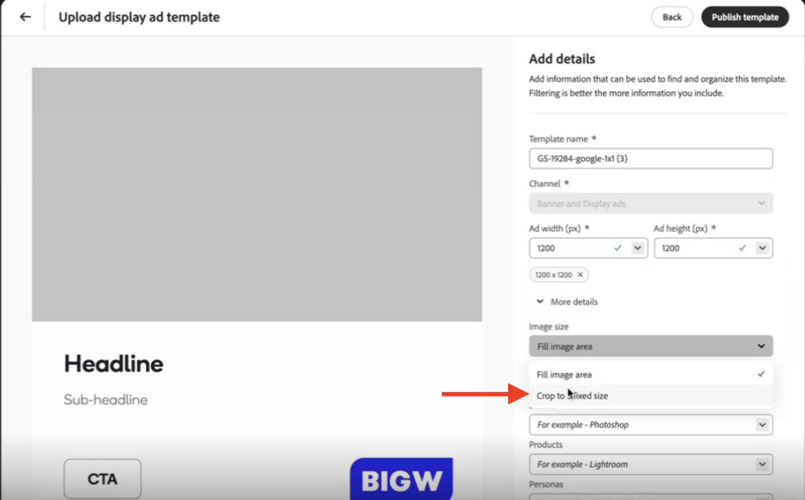

# Bonnes pratiques pour utiliser des modèles

Les modèles réduisent considérablement le temps et les efforts nécessaires à la génération de nouveau contenu en fournissant un point de départ qui inclut des dispositions préconfigurées et des éléments de conception.

Appliquez les recommandations suivantes lorsque vous utilisez des modèles avec GenStudio for Performance Marketing :

1. Explorez les [éléments de modèle](#know-about-template-elements).
1. Configurez les [directives relatives aux canaux](#configure-channel-guidelines) pour une personnalisation efficace du contenu.
1. Concevez en tenant compte des [normes d’accessibilité](accessibility-for-templates.md) pour une expérience optimale.
1. Suivez les [directives relatives aux modèles spécifiques à, chaque canal](#follow-channel-specific-template-guidelines).
1. Lors de l’utilisation des [modèles Express](/help/user-guide/templates/express-templates.md), tenez compte des conseils spécifiques disponibles dans la section consacrée aux [bonnes pratiques de conversion des modèles Express vers GenStudio](#express-to-genstudio-template-best-practices).
>>
Découvrez les principes de base des éléments et des procédures de modèle dans [Utiliser des modèles](use-templates.md). Approfondissez également la [personnalisation d’un modèle](customize-template.md) pour obtenir des instructions spécifiques à utiliser dans votre prochaine campagne.

## Utiliser les éléments de modèle appropriés

Chaque type de modèle utilise différents éléments pour créer une structure permettant la création de contenu spécifique à chaque canal. [Familiarisez-vous avec les parties d’un modèle](use-templates.md#template-elements) et incluez les meilleurs éléments pour votre contenu et votre type de modèle.

Lors de la personnalisation de votre modèle, utilisez les noms de champ à la place de ces éléments lorsque vous avez besoin de GenStudio for Performance Marketing pour générer du contenu.

Voir [Éléments de modèle](use-templates.md#template-elements).

## Utiliser du texte d’espace réservé dans les modèles

Le texte d’espace réservé peut aider à définir la syntaxe ou la structure du contenu à remplir ultérieurement dans un modèle par un utilisateur ou une utilisatrice. Par exemple, {first_name}.{last_name}@email.etc. pour définir une adresse e-mail. Cependant, certains délimiteurs courants sont déjà réservés à d’autres significations dans GenStudio for Performance Marketing :

❌ `< >` - utilisé pour les balises HTML.
❌ `{{ }}` - utilisé pour les expressions Handlebar.

Utilisez des crochets ou des accolades simples pour indiquer le texte de l’espace réservé afin d’éviter toute confusion avec les balises existantes.

✅ `{first_name}` : espace réservé pour le prénom.

## Configurer les directives relatives aux canaux

Il est essentiel de définir des directives claires pour les canaux afin de s’assurer que le contenu généré correspond aux exigences et aux objectifs de votre marque. Les directives relatives aux canaux vous permettent de spécifier des règles pour des éléments tels que le ton, la longueur et le style utilisés dans votre modèle. Par exemple, vous pouvez définir un nombre maximal de caractères pour le corps du texte ou exiger un style d’appel à l’action spécifique. En définissant ces directives à l’avance, vous réduisez la nécessité d’écrire des instructions détaillées dans chaque prompt d’IA, ce qui permet de rationaliser le processus de génération de contenu et d’assurer une cohérence entre vos e-mails.

Vérifiez et définissez les [directives relatives aux canaux](/help/user-guide/guidelines/brands.md#channel-guidelines) de votre marque pour tous les champs clés de votre modèle. Si vous ne définissez pas de directives, les [directives par défaut relatives aux canaux](/help/user-guide/guidelines/brands.md#default-channel-guidelines) sont appliquées, ce qui peut ne pas refléter entièrement les exigences de votre marque.

Découvrez comment les [directives relatives aux marques, aux produits et aux personas](/help/user-guide/guidelines/overview.md) influencent le contenu généré et comment les adapter à vos objectifs marketing.

## Charger des images pour les modèles

Les images utilisées dans les modèles doivent provenir du référentiel de contenu et doivent être chargées correctement afin de garantir que l’image s’affiche correctement.

Lorsqu’un modèle comporte une image en plein format (fond perdu), l’image sélectionnée est automatiquement redimensionnée pour s’adapter aux dimensions complètes du modèle. Cependant, si l’image ne correspond pas au rapport L/H du modèle, elle est recadrée pour s’adapter aux dimensions du modèle et peut ne pas s’afficher comme prévu.

Il n’existe aucune fonctionnalité d’« ajustement automatique » pour les images incluses dans les modèles.

Pour résoudre le problème de recadrage des images, les utilisateurs et utilisatrices doivent définir le rapport L/H de l’image à utiliser dans le modèle lors de son chargement dans le référentiel de contenu. Lors du chargement d’un modèle approuvé :

1. [Poursuivez le processus de chargement du modèle](/help/user-guide/templates/use-templates.md#add-a-template) jusqu’à la page **[!UICONTROL Ajouter des détails]**.

2. Définissez le rapport L/H de l’image à utiliser dans le modèle dans **[!UICONTROL Largeur de la publicité (px)]** et **[!UICONTROL Hauteur de la publicité (px)]**. Cela définira la fenêtre d’image pour la section du modèle affichant l’image.

3. Dans la section **[!UICONTROL Plus de détails]**, sélectionnez le menu déroulant **[!UICONTROL Taille de l’image]** et choisissez _Recadrer à une taille fixe_.
   {width="80%"}

Pour déterminer la taille et le rapport L/H d’une image dans le navigateur :

1. Inspectez l’image.
   - Sous Windows/Linux :
     - Appuyez sur F12.
   - Sous macOS :
     - Appuyez sur Commande + Option + I.

1. Pointez sur l’image.

1. Notez le rapport L/H. Utilisez cette option pour définir le rapport L/H de l’image dans le modèle.

Lorsque ces détails ne sont pas appliqués pendant le chargement, l’image est censée correspondre à l’intégralité du rapport L/H du modèle et les images qui ne correspondent pas exactement à ce format apparaîtront recadrées.

{width="60%"}

**❌Image recadrée dans un modèle de publicité display**

{width="60%"}

**✅Image entièrement affichée**

## Suivre les directives relatives aux modèles spécifiques à chaque canal

Lors de la création de modèles, assurez-vous qu’ils répondent aux exigences spécifiques du canal prévu. Créez des modèles qui prennent en compte la disposition et les exigences visuelles de chaque canal. Il existe des directives générales qui s’appliquent à tous les modèles, notamment :

- Utiliser un code HTML propre et en responsive design, ainsi que du CSS intégré
- Utiliser les polices Adobe ou Google.
- Ne pas utiliser **JavaScript**

{{note-css-effects}}

Consultez d’autres conseils et contraintes lorsque vous utilisez chaque type de modèle afin de garantir des performances optimales :

- [E-mails](/help/user-guide/templates/email-template.md)
- [Publicités display et bannières](/help/user-guide/templates/display-template.md)
- [LinkedIn](/help/user-guide/templates/linkedin-template.md)
- [Publicités Meta](/help/user-guide/templates/meta-template.md)

## Bonnes pratiques de conversion des modèles Express vers GenStudio

>[!VIDEO](https://video.tv.adobe.com/v/3502403?learn=on&enablevpops)

Les conseils suivants vous aident à obtenir des résultats fiables lorsque vous convertissez des conceptions à partir d’[!DNL Adobe Express] en modèles pour [!DNL GenStudio for Performance Marketing].

### Utiliser des modèles à plusieurs variantes

Dans [!DNL Adobe Express], les pages peuvent représenter plusieurs variations de taille ou de rapport L/H dans un fichier de modèle.
Lorsque vous sélectionnez le modèle dans [!DNL GenStudio for Performance Marketing], toutes les variations apparaissent dans la zone de travail.

Ce comportement est une amélioration par rapport aux modèles HTML, qui ne prennent en charge qu’une seule variante par fichier.

### Verrouiller les champs pour contrôler ce que les responsables marketing peuvent modifier

Utilisez le verrouillage pour communiquer votre intention. Par exemple, verrouillez une mention légale afin qu’elle ne soit jamais générée par l’IA, mais laissez un titre flexible pour la génération.

Cliquez avec le bouton droit de la souris sur un élément dans [!DNL Adobe Express] pour définir le comportement du verrouillage :

- **[!UICONTROL Verrouillage intégral]** : l’élément est statique et l’IA ne génère pas de contenu pour lui.
- **[!UICONTROL Verrouillage et autorisation du remplacement de l’image]** : verrouille la taille et la position, mais permet aux utilisateurs et utilisatrices de changer l’image. Cette option est idéale pour les logos.
- **[!UICONTROL Verrouillage et autorisation du remplacement du texte]** : verrouille la taille et la position, mais permet aux utilisateurs et utilisatrices de modifier le texte. L’IA ne génère pas automatiquement de contenu pour cet élément.
- **Entièrement flexible** (déverrouillé) : les utilisateurs et utilisatrices peuvent déplacer et redimensionner l’élément, et l’IA traite cet élément comme du contenu à générer.

### Nommer les calques pour améliorer le mappage IA

Lorsque vous convertissez une conception en modèle, l’IA analyse la conception et mappe les champs tels que l’en-tête, le CTA et le corps. L’IA mappe les modèles simples avec plus de précision que les dispositions très complexes.

**Bonne pratique :** dans la copie d’espace réservé, incluez le type de champ prévu (par exemple, `headline`, `sub-headline` ou `CTA`) pour aider l’IA à mapper correctement les champs. Cette approche peut réduire les erreurs de mappage.

### Convertir en modèle

1. Dans [!DNL Adobe Express], cliquez sur **[!UICONTROL Partager]** > **[!UICONTROL Convertir en modèle]**.
1. Seuls les onglets **[!UICONTROL Info]** et **[!UICONTROL Verrouillages]** sont transférés vers [!DNL GenStudio for Performance Marketing].
1. Au moment de la conversion, choisissez le mode de fonctionnement du déverrouillage :
   - **[!UICONTROL Autoriser les utilisateurs et utilisatrices à déverrouiller]**
   - **[!UICONTROL Empêcher tout déverrouillage]**
   - **[!UICONTROL Définir une phrase secrète]** : solution intermédiaire qui décourage les modifications occasionnelles sans bloquer l’accès de manière permanente.

### Conserver une copie du fichier de conception d’origine

La conversion crée un fichier de modèle [!DNL Adobe Express] distinct, mais le fichier de conception d’origine reste modifiable.

**Conseil :** conservez l’original afin de pouvoir réviser la conception, créer des variations et générer de nouveaux modèles ultérieurement.

### Partager pour une plus grande visibilité

Après la conversion, le modèle n’est visible que par vous, par défaut. Vous pouvez le partager avec des personnes ou avec l’ensemble de l’organisation.

**Exigence :** [!DNL Adobe Express] et [!DNL GenStudio for Performance Marketing] doivent utiliser la même organisation IMS pour que les modèles puissent se synchroniser. Les modèles apparaissent généralement dans [!DNL GenStudio for Performance Marketing] presque immédiatement après la conversion.

### Contrôler le mappage des champs par IA

Après avoir sélectionné un modèle, l’IA mappe les champs une fois par modèle, en attribuant des libellés tels que **[!UICONTROL média principal]**, **[!UICONTROL généré]** ou **[!UICONTROL verrouillé]**. Vous pouvez ajuster manuellement les mappages lorsque l’IA attribue des champs de manière incorrecte.

Utilisez le bouton **[!UICONTROL Activer la génération]** par champ pour activer ou désactiver la génération avant de lancer la génération. Vous pouvez ajuster manuellement les mappages lorsque l’IA attribue des champs de manière incorrecte. Des corrections permanentes concernant les mappages de modèles sont prévues pour une version ultérieure.

### Concevoir dans [!DNL Adobe Express], assembler dans [!DNL GenStudio for Performance Marketing]

Tenez compte des workflows de conception suivants afin d’utiliser chaque service de manière optimale :

- Effectuer les tâches de conception dans [!DNL Adobe Express] : couleurs, dispositions et graphiques.
- Utiliser [!DNL GenStudio for Performance Marketing] pour assembler et générer du contenu à partir de ces modèles.
- Utiliser les marques [!DNL Adobe Express] (couleurs, logos, polices et graphiques) pour la gouvernance de la conception.
- Utiliser les marques [!DNL GenStudio for Performance Marketing] pour les changements de couleur de police après la génération.

### Limites des e-mails

L’e-mail n’est **pas** pris en charge sur la zone de travail Horizon pour le workflow de modèle [!DNL Adobe Express]. L’e-mail continue d’utiliser le processus de modèle HTML traditionnel.

### Utiliser des polices personnalisées.

Les équipes demandent souvent comment les polices personnalisées fonctionnent avec les modèles [!DNL Adobe Express]. Les administrateurs et administratrices peuvent être amenés à accepter l’offre concernant les polices personnalisées dans Admin Console avant que ces polices ne soient disponibles. Consultez [Utiliser des modèles  [!DNL Adobe Express] ](express-templates.md).
