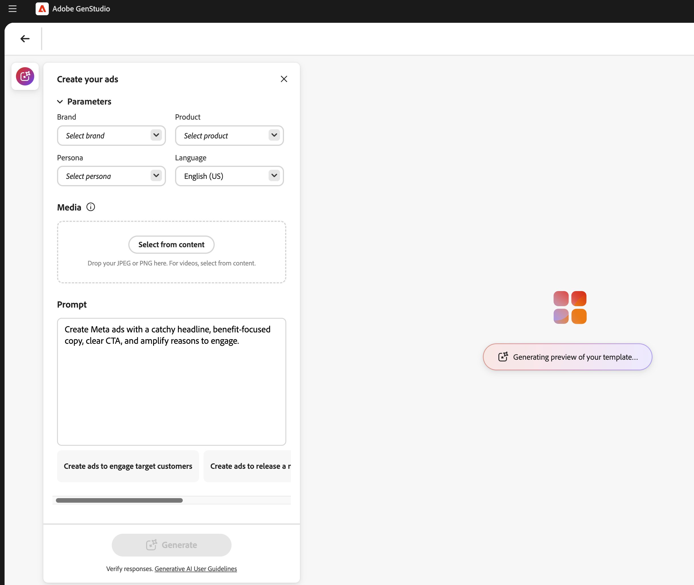
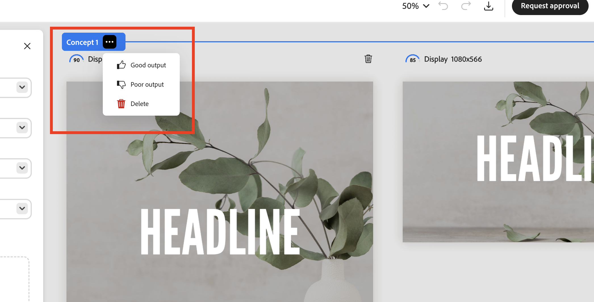
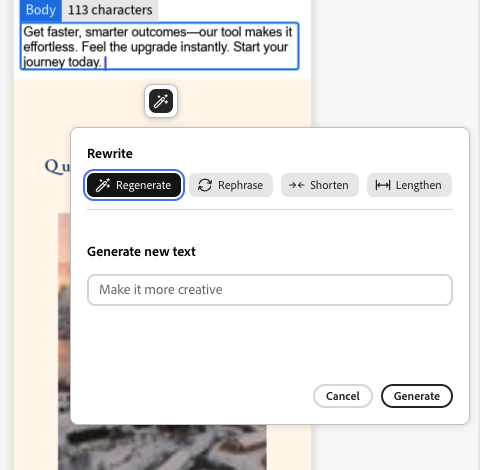
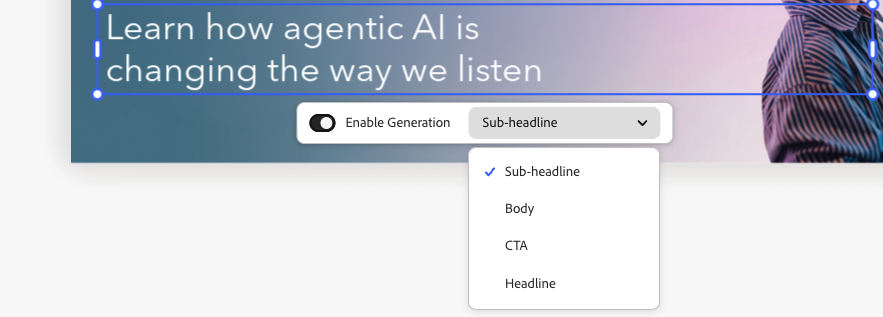
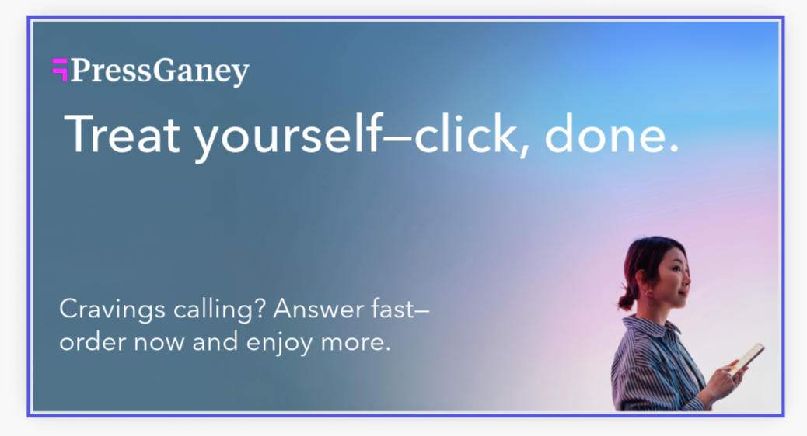

# Utilisation de modèles de [!DNL Adobe Express]

[!DNL GenStudio for Performance Marketing] pouvez utiliser des modèles qui ont été créés et conçus dans [!DNL Adobe Express]. Obtenez des ressources de marque de [!DNL Adobe Express] et utilisez ces puissants outils pour les intégrer dans des campagnes et des [!DNL Experiences] marketing attrayantes.

Ce guide explique les exigences et les fonctionnalités relatives aux modèles de [!DNL Adobe Express]. Pour obtenir d’autres conseils et bonnes pratiques, voir [Bonnes pratiques relatives à l’utilisation des modèles](/help/user-guide/templates/best-practices-for-templates.md#express-to-genstudio-template-best-practices).

## À propos des modèles dans [!DNL Adobe Express]

Dans [!DNL Adobe Express], les [nouveaux documents peuvent être créés à l’aide de modèles de démarrage existants](https://helpx.adobe.com/express/web/documents-and-presentations/text-flow-template.html?x-product=Helpx%2F1.0.0&x-product-location=Search%3AForums%3Alink%2F3.7.5) fournis dans l’application, ou avec des modèles [personnalisés pouvant inclure des restrictions utiles de la marque](https://helpx.adobe.com/express/web/brands-libraries-projects/create-manage-brands/edit-shared-template.html) tels que :

- [Éléments verrouillés](https://helpx.adobe.com/express/web/invite-collaborate/object-locking.html) non modifiables
- Restrictions de verrouillage qui contrôlent la manière dont les utilisateurs peuvent déverrouiller des éléments si nécessaire

Les paramètres de verrouillage qui ont été définis sur le modèle dans [!DNL Adobe Express] seront également appliqués dans [!DNL GenStudio for Performance Marketing]. Utilisez [les [!DNL Adobe Express] instructions pour créer un modèle personnalisé avec des restrictions de marque](https://helpx.adobe.com/express/web/brands-libraries-projects/create-manage-brands/template-control.html).

Pour utiliser des polices personnalisées dans un modèle Express, les administrateurs doivent d’abord accepter l’offre de qualification des polices personnalisées dans l’Admin Console, qui est incluse dans les droits de licence Express.

## Rechercher des modèles Express

Les utilisateurs verront de nouveaux onglets dans Créer pour sélectionner des modèles Express. Les modèles Express sont accessibles dans GenStudio for Performance Marketing lorsque ces modèles sont :

- Créé par l’utilisateur
- Partagé avec l’utilisateur
- Partagé avec l’organisation de l’utilisateur, utilisant la même organisation IMS dans les deux applications

Recherchez les modèles Express disponibles dans le workflow de création, après avoir sélectionné un type de modèle. Les modèles Express ne sont disponibles que pour les types :

- [!DNL Meta]
- [!DNL Display]
- [!DNL LinkedIn]
- [!DNL TikTok]

Dans la barre supérieure, sous **[!UICONTROL Sélectionner un modèle]**, recherchez **Modèles Express**.

{width=70%}

Lorsque vous sélectionnez un modèle de [!DNL Express] et cliquez sur **[!UICONTROL Utiliser]**, les paramètres de prébrouillon et l’invite s’affichent dans un panneau contextuel à gauche. Cliquez sur le bouton **[!UICONTROL Générer]** pour créer un nouveau contenu avec le modèle sélectionné.

{width=90%}

>[!IMPORTANT]
>
>Pendant la génération du contenu, les calques de modèle Express seront automatiquement balisés avec des rôles de champ pour [!DNL GenStudio for Performance Marketing]. Les éléments d’un modèle peuvent également être [&#x200B; balisés manuellement &#x200B;](#manual-tagging-of-templates).

## À propos des variantes et des [!DNL Experiences] avec des modèles de [!DNL Adobe Express]

[!DNL Express] modèles offrent de nombreuses fonctionnalités que vous connaîtrez bien lorsque vous [gérez d’autres variantes](https://experienceleague.adobe.com/en/docs/genstudio-for-performance-marketing/user-guide/create/manage-variants#manually-edit-text). Cependant, il existe quelques ajouts puissants pour rationaliser tout workflow de contenu à partir de [!DNL Express]. Cette section décrit les fonctionnalités exclusives à l’implémentation [!DNL Adobe Express].

### Génération automatique de plusieurs tailles

Lorsque [plusieurs pages ont été créées pour une ressource dans [!DNL Express]](https://helpx.adobe.com/express/web/arrange-layers-and-pages/add-pages.html), ces pages sont transférées vers tout modèle créé à partir de cette ressource. Les pages Express sont générées chacune en tant que tailles différentes du contenu créatif en [!DNL GenStudio for Performance Marketing].

Lorsqu’il existe un contenu à plusieurs tailles pour une ressource dans [!DNL Express], des variantes peuvent être générées pour toutes ces tailles en une seule génération.

### Repositionnement et redimensionnement d’éléments

Les éléments d’un modèle peuvent être redimensionnés ou déplacés pour s’adapter en cliquant simplement sur ces éléments et en les faisant glisser dans le volet Zone de travail.

Redimensionnez en cliquant sur un élément et en le faisant glisser depuis un coin.

### Fonctionnalités d’en-tête du volet Zone de travail

Utilisez les boutons de l’en-tête du volet Zone de travail pour :

1. Renommer le brouillon
1. Modification du niveau de zoom pour l’affichage
1. Annuler et rétablir les modifications

### Attribuer des commentaires sur le groupe d’expériences

Attribuez des commentaires à chaque groupe de variantes générées. Ces étiquettes de commentaires aident l’IA à comprendre quelles variantes doivent être prises en compte dans les générations suivantes.

Cliquez sur « ... ». pour ouvrir la liste déroulante pour :

- Bon rendement
- Mauvais rendement
- Supprimer - Supprime le groupe de variantes.

### Suppression d’une variante

Une taille de variante unique générée dans un groupe d’expériences peut être supprimée à l’aide de l’icône de la corbeille.

{width=300}

### Barre d’espacement à panoramique

Maintenez la touche **[!UICONTROL Espace]** enfoncée pour activer une fonction de glisser-cliquer afin de « tirer » le volet d’affichage Zone de travail.

Vous pouvez également déplacer le volet d&#39;affichage à l&#39;aide d&#39;un défilement à deux doigts.

### Modification manuelle de texte

Vous pouvez modifier les champs de texte dans les variantes générées. Affinez le texte pour votre audience en expérimentant différentes expressions et différents verbes et en appliquant une mise en forme. Par exemple, vous pouvez mettre en gras et aligner à droite le texte d’une variante pour adapter la disposition d’une image.

{width=60%}

Le formatage de texte disponible inclut les éléments suivants :

- Gras, Italique et Souligné
- Couleur du texte (noir, blanc ou couleurs de la marque)
- Alignement à gauche, au centre et à droite
- Listes à puces et ordonnées
- Taille du texte
- Exposant ou indice

**Pour modifier le texte manuellement dans les variantes générées** :

1. Après avoir généré un ensemble de variantes, double-cliquez sur le texte modifiable dans une variante.
1. Saisissez le nouveau texte.
1. Pour mettre en forme le texte, cliquez sur ou saisissez dans l’élément de zone de texte. Les options de formatage s’affichent dans une barre contextuelle. Maintenez la touche Maj enfoncée pour masquer la barre et afficher le texte.
1. Cliquez en dehors du champ de texte pour enregistrer les modifications.

### Utiliser les zones de flux de texte liées

[!DNL Adobe Express] prend en charge le flux de texte, qui permet à un auteur de modèle de lier deux zones de texte afin qu’une seule phrase circule dans les deux zones. Par exemple, un titre peut commencer dans une zone et finir dans une autre, ou une partie d’une expression peut utiliser un style différent du reste. Lorsqu’un modèle avec flux de texte est importé dans [!DNL GenStudio for Performance Marketing], la zone de travail reconnaît et honore cette liaison. En savoir plus sur la création de zones de texte liées dans [Flux de texte dans Adobe Express](https://helpx.adobe.com/express/web/create-and-edit-documents-and-webpages/create-and-edit-documents/text-flow-faq.html).

Vous générez une copie pour les zones de texte liées de la même manière que vous générez tout autre champ, sans configuration supplémentaire requise. Les zones liées se comportent comme une seule expression connectée tout au long de la génération, de la modification et de la révision des variantes. Vous n’avez donc jamais besoin de fractionner, copier ou repositionner du texte entre les zones.

Si la copie générée est trop longue pour tenir dans les zones liées, une ligne rouge apparaît au bas de la dernière zone pour indiquer le dépassement, correspondant au même indicateur utilisé dans [!DNL Adobe Express]. Raccourcissez la copie ou régénérez le champ pour supprimer le débordement.

### Afficher les calques

Vous pouvez sélectionner rapidement un calque individuel d’une variante et y apporter des modifications, telles que la régénération de sections ou le recadrage d’images. Lorsque vous sélectionnez un calque individuel, les champs modifiables ou les images du calque sont mis en surbrillance.

**Pour afficher les calques d’une variante** :

1. Après avoir généré un ensemble de variantes, cliquez sur un champ ou une image modifiable dans une variante. Les calques s’affichent dans une ligne de mosaïques en haut à droite.
   {width=50%}
1. Cliquez sur une mosaïque de calque pour la sélectionner. Le calque sélectionné est mis en surbrillance pour la variante.
1. Apportez les modifications nécessaires au calque sélectionné.

### Réécrire les sections

[!DNL GenStudio for Performance Marketing] dispose de la fonctionnalité intégrée pour régénérer des sections de variantes générées. Vous pouvez reformuler, raccourcir ou allonger le texte, ou ajouter de nouvelles invites pour générer du nouveau contenu.

Par exemple, vous pouvez générer à nouveau la section titre d’une variante d’annonce Meta pour voir à quoi elle ressemble avec une ressource en arrière-plan spécifique. Vous pouvez **[!UICONTROL Reformuler]**, **[!UICONTROL Raccourcir]** ou **[!UICONTROL Allonger]** le contenu textuel d’une section ou **[!UICONTROL Régénérer]** le texte à l’aide d’une invite de guidage.

{width=50%}

**Pour réécrire des sections de variantes individuelles** :

1. Après avoir généré un ensemble de variantes, cliquez une seule fois sur un texte modifiable dans une variante. L’icône en forme de baguette s’affiche.
1. Cliquez sur l’icône représentant une baguette pour ouvrir le volet Réécrire .
1. Pour modifier le texte existant, sélectionnez **[!UICONTROL Reformuler]**, **[!UICONTROL Raccourcir]** ou **[!UICONTROL Allonger]**.
1. Pour générer de nouvelles options de phrasé, sélectionnez **[!UICONTROL Régénérer]** et saisissez une nouvelle invite.
   1. Cliquez sur **[!UICONTROL Générer]**.
1. Les résultats s’affichent sous forme d’options dans le volet. Sélectionnez l’option souhaitée et cliquez sur **[!UICONTROL Remplacer]**. La variante est mise à jour avec le texte révisé.

{width=50%}

### Recadrer les ressources

Vous pouvez recadrer et repositionner manuellement des ressources d’image dans des variantes individuelles générées à l’aide de l’outil Recadrer.

**Pour recadrer et repositionner des images dans des variantes** :

1. Après avoir généré un ensemble de variantes, double-cliquez sur une ressource pour activer le cadre de sélection.
1. Ajustez le cadre de sélection de l’image en le faisant glisser depuis n’importe quel bord ou coin, ou faites glisser l’image entière à la position souhaitée.

### Permutation de ressources

Vous pouvez ajouter ou remplacer des images, des logos approuvés ou des ressources vidéo dans des variantes générées directement à partir de l’interface utilisateur de la zone de travail.

**Pour ajouter ou échanger des ressources dans une variante** :

1. Après avoir généré un ensemble de variantes, cliquez sur une ressource (ou sur la zone de la ressource image si une image n’existe pas actuellement). Une icône de permutation s’affiche.
1. Cliquez sur l’icône de permutation pour ouvrir la page Sélectionner des ressources .
1. Utilisez les filtres et la fonction de recherche de la vue de contenu des ressources GenStudio pour affiner davantage les résultats de votre recherche.
1. Vous pouvez également utiliser les images disponibles dans les référentiels Assets Content Hub [!DNL Adobe Experience Manager] (AEM) connectés en sélectionnant ce référentiel dans le menu **[!UICONTROL Emplacement]**.
1. Cliquez pour sélectionner une image, puis cliquez sur **[!UICONTROL Utiliser]**. L’image est ajoutée ou permutée dans la variante applicable.

### Balisage manuel des modèles

Les éléments des modèles sont automatiquement balisés lors de la [génération du modèle](#find-express-templates) dans le workflow Créer . Mais ces éléments peuvent également être balisés manuellement.

**Pour baliser manuellement un élément de modèle** :

1. Sélectionnez l’élément dans le modèle.
1. Utilisez la liste déroulante pour sélectionner la balise de cet élément.
   {width=80%}

Les options de balisage varient en fonction du type d’élément.

### Restrictions de verrouillage des modèles

Les modèles peuvent inclure des [éléments verrouillés](https://helpx.adobe.com/express/web/invite-collaborate/object-locking.html) qui transfèrent des [!DNL Express] et contrôlent la manière dont certaines fonctionnalités peuvent être modifiées. Ces paramètres sont respectés par le modèle et peuvent également être modifiés sur le modèle :

1. Sélectionnez un élément verrouillé sur le modèle.
1. Cliquez sur l’icône de verrouillage en haut à gauche de l’élément sélectionné.
1. Sélectionnez l’option appropriée pour déverrouiller l’élément.
   {width=60%}

### Assemblage Vidéo

Les modèles qui incluent des vidéos peuvent tirer parti des fonctions d’assemblage vidéo.

**Pour utiliser Video Assembly** :

1. Sélectionnez une expérience et cliquez sur le bouton **[!UICONTROL Modifier]** pour passer en mode thème et utiliser les fonctions d’assemblage vidéo. Seule la variante unique s’affiche et la ligne de scène s’affiche en bas.
   {width=70%}
1. Ajustez votre expérience vidéo. Les options d’assemblage vidéo incluent :
   - Lecture de vidéos
   - Son muet et son réactivé
   - Ajoutez du nouveau contenu vidéo avec le bouton « + ».
   - Paramètres de durée vidéo
   - Modification de l’ordre du contenu vidéo par glisser-déposer
1. Lorsque vous avez terminé de modifier votre vidéo, utilisez le bouton **[!UICONTROL Quitter]** en haut pour enregistrer les modifications et revenir à la zone de travail infinie.

### Modification des images à l’aide de l’option Développer de manière générative

Les limites des calques d’image peuvent être étendues avec l’IA pour s’adapter à toutes les dimensions souhaitées dans une expérience.

**Pour développer une image avec Generative Expand** :

1. Sélectionnez un calque d’image déverrouillé et cliquez sur le bouton **[!UICONTROL Développer]** au bas du cadre d’image.
   {width=70%}
1. Tirez l’image aux dimensions souhaitées pour qu’elle soit développée. La fenêtre Développer les options s’affiche. Dans les options Développer , vous pouvez faciliter le développement en procédant comme suit :
   - Saisir une invite
   - Choisir d’ajuster au cadre
   - Réinitialiser les dimensions
     {width=50%}
1. Cliquez sur **[!UICONTROL Développer]** pour créer la génération. Les variantes parmi lesquelles choisir s’affichent au bas du cadre.
1. Sélectionnez la meilleure variante et cliquez sur **[!UICONTROL Conserver]**.
   {width=50%}

{width=60%}

### Validation de la marque

Utilisez le panneau _Vérification de contenu_ pour conserver une identité de marque cohérente, les normes d’accessibilité ADA, les directives de la plateforme et l’alignement des variantes.

Consultez [Validation de la marque](/help/user-guide/guidelines/brand-validation.md).

## Vérifier et approuver

Après avoir modifié et ajusté vos variantes, approuvez et publiez votre contenu avec [le workflow Révisions et approbation](https://experienceleague.adobe.com/en/docs/genstudio-for-performance-marketing/user-guide/approve/overview).

